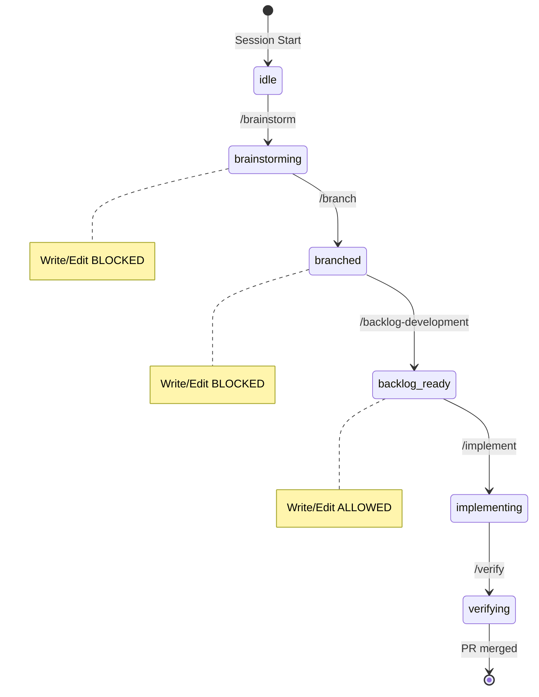

# Workflow Ecosystem Usage Patterns

This directory contains visual, file-by-file illustrations of how the workflow ecosystem plugin works at different user experience levels.

## Quick Links

| Document | Description |
|----------|-------------|
| [Beginner Pattern](./beginner-pattern.md) | First-time user with guided workflow |
| [Intermediate Pattern](./intermediate-pattern.md) | Full automation with subagent orchestration |
| [Expert Pattern](./expert-pattern.md) | Power user customization and escape hatches |
| [File Reference Matrix](./file-reference-matrix.md) | Complete inventory of all files and their roles |

---

## Workflow State Machine

The plugin enforces a state machine that guides users through a disciplined development workflow:



---

## Three-Tier Automation

The ecosystem provides three tiers of automation, each building on the previous:

```
┌─────────────────────────────────────────────────────────────────────┐
│  TIER 1: SKILLS                                                     │
│  ─────────────────                                                  │
│  Core competencies and disciplines                                  │
│  Invoked via: Skill tool                                           │
│  Files: skills/<name>/SKILL.md                                     │
└─────────────────────────────────────────────────────────────────────┘
                              ▲
                              │ Skills define HOW
                              │
┌─────────────────────────────────────────────────────────────────────┐
│  TIER 2: COMMANDS                                                   │
│  ─────────────────                                                  │
│  User-invokable workflow entry points                               │
│  Invoked via: /command-name                                         │
│  Files: commands/<name>.md                                          │
└─────────────────────────────────────────────────────────────────────┘
                              ▲
                              │ Commands orchestrate WHAT
                              │
┌─────────────────────────────────────────────────────────────────────┐
│  TIER 3: AGENTS                                                     │
│  ─────────────────                                                  │
│  Specialized subagents for task execution                           │
│  Invoked via: Task tool                                             │
│  Files: agents/<name>.md                                            │
└─────────────────────────────────────────────────────────────────────┘
```

---

## Quick Reference: All Components

### Commands (8)

| Command | Purpose | Invokes Skill |
|---------|---------|---------------|
| `/brainstorm` | Explore requirements before implementation | `brainstorming` |
| `/branch` | Create/switch feature branches | `git-workflow` |
| `/backlog-development` | Create bite-sized backlog | `developing-backlogs` |
| `/implement` | Execute backlog with subagents | `orchestrating-subagents` |
| `/verify` | Run pre-completion verification | `verification` |
| `/commit` | Create atomic commit | `git-workflow` |
| `/pr` | Create pull request | `git-workflow` |
| `/workflow` | Manage enforcement state | `workflow-management` |

### Skills (12)

| Skill | Purpose | Auto-triggered? |
|-------|---------|-----------------|
| `using-ecosystem` | Ecosystem orientation | Yes (SessionStart) |
| `brainstorming` | Requirements exploration | Via /brainstorm |
| `developing-backlogs` | Backlog creation | Via /backlog-development |
| `orchestrating-subagents` | Subagent dispatch | Via /implement |
| `verification` | Evidence-based completion | Via /verify |
| `git-workflow` | Branch/commit/PR workflow | Via /branch, /commit, /pr |
| `workflow-management` | State management | Via /workflow |
| `subagent-state-management` | Subagent patterns | Referenced by agents |
| `systematic-debugging` | Debugging methodology | Referenced by agents |
| `python-development` | Python standards | Referenced when applicable |
| `typescript-development` | TypeScript patterns | Referenced when applicable |
| `angular-development` | Angular patterns | Referenced when applicable |

### Agents (3)

| Agent | Role | Dispatched By |
|-------|------|---------------|
| `code-implementer` | TDD implementation | `/implement` orchestrator |
| `spec-reviewer` | Requirements compliance | `/implement` orchestrator |
| `quality-reviewer` | Code quality assessment | `/implement` orchestrator |

### Hooks (12 scripts + 1 config)

| Hook Script | Type | Purpose |
|-------------|------|---------|
| `hooks.json` | Config | Defines all hook triggers |
| `session-start.sh` | SessionStart | Injects `using-ecosystem` skill |
| `main-branch-protection.sh` | PreToolUse | **BLOCKS** edits on main/master |
| `workflow-phase-check.sh` | PreToolUse | **BLOCKS** edits before backlog |
| `brainstorm-mode-check.sh` | PreToolUse | **BLOCKS** edits during brainstorm |
| `tdd-precommit-check.sh` | PreToolUse | **BLOCKS** commits without tests |
| `verify-before-commit.sh` | PreToolUse | Reminds about verification |
| `validate-task-description.sh` | PreToolUse | Validates subagent task descriptions |
| `phase-transition.sh` | PostToolUse | Updates workflow phase |
| `brainstorm-start.sh` | PostToolUse | Sets brainstorming marker |
| `brainstorm-end.sh` | PostToolUse | Clears brainstorming marker |
| `workflow-skip-set.sh` | PostToolUse | Sets enforcement skip |
| `run-hook.cmd` | Wrapper | Cross-platform execution |

---

## Session State Files

The plugin tracks workflow state using files in `$CLAUDE_SESSION_DIR`:

| File | Purpose | Created By | Read By |
|------|---------|------------|---------|
| `.workflow_phase` | Current phase | `phase-transition.sh` | `workflow-phase-check.sh` |
| `.workflow_skip` | Bypass enforcement | `workflow-skip-set.sh` | All blocking hooks |
| `.brainstorming_active` | Brainstorm mode | `brainstorm-start.sh` | `brainstorm-mode-check.sh` |
| `.backlog_path` | Current backlog | Commands | Skills |

---

## Enforcement Summary

### What Gets BLOCKED

| Action | Condition | Hook |
|--------|-----------|------|
| Write/Edit | On main/master branch | `main-branch-protection.sh` |
| Write/Edit | During brainstorming phase | `workflow-phase-check.sh` |
| Write/Edit | After branch but before backlog | `workflow-phase-check.sh` |
| Write/Edit | While brainstorming active | `brainstorm-mode-check.sh` |
| Git commit | Source files without tests | `tdd-precommit-check.sh` |

### Escape Hatch

```bash
/workflow skip    # Bypass ALL enforcement for this session
/workflow status  # Check current phase and skip state
/workflow reset   # Re-enable enforcement
```

---

## Plugin Structure

```
.claude-plugin/
├── plugin.json          # Plugin manifest
└── marketplace.json     # Marketplace metadata

commands/                # User-invokable commands
├── brainstorm.md
├── branch.md
├── backlog-development.md
├── implement.md
├── verify.md
├── commit.md
├── pr.md
└── workflow.md

skills/                  # Core competencies
├── using-ecosystem/SKILL.md
├── brainstorming/SKILL.md
├── developing-backlogs/SKILL.md
├── orchestrating-subagents/SKILL.md
├── verification/SKILL.md
├── git-workflow/SKILL.md
├── workflow-management/SKILL.md
├── subagent-state-management/SKILL.md
├── systematic-debugging/SKILL.md
├── python-development/SKILL.md
├── typescript-development/SKILL.md
└── angular-development/SKILL.md

agents/                  # Subagent prompts
├── code-implementer.md
├── spec-reviewer.md
└── quality-reviewer.md

hooks/                   # Enforcement scripts
├── hooks.json
├── run-hook.cmd
├── session-start.sh
├── main-branch-protection.sh
├── workflow-phase-check.sh
├── brainstorm-mode-check.sh
├── tdd-precommit-check.sh
├── verify-before-commit.sh
├── validate-task-description.sh
├── phase-transition.sh
├── brainstorm-start.sh
├── brainstorm-end.sh
└── workflow-skip-set.sh
```

---

## How to Read These Guides

Each pattern document follows this structure:

1. **Scenario Overview** - Abstract description of the user journey
2. **Command Sequence** - What the user types
3. **Under the Hood** - File-by-file trace with:
   - Which file is activated
   - What the file does (with line number references)
   - What triggers next (hooks, skill invocations)
   - Mermaid sequence diagrams for complex flows
   - ASCII diagrams for simple inline traces
4. **Files Referenced** - Summary of all files touched in the pattern

Start with [Beginner Pattern](./beginner-pattern.md) to understand the core workflow, then progress to [Intermediate](./intermediate-pattern.md) and [Expert](./expert-pattern.md) patterns.
