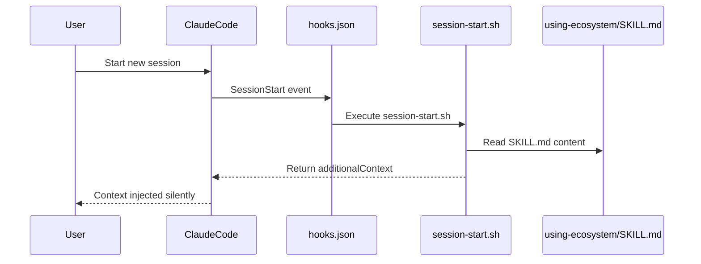
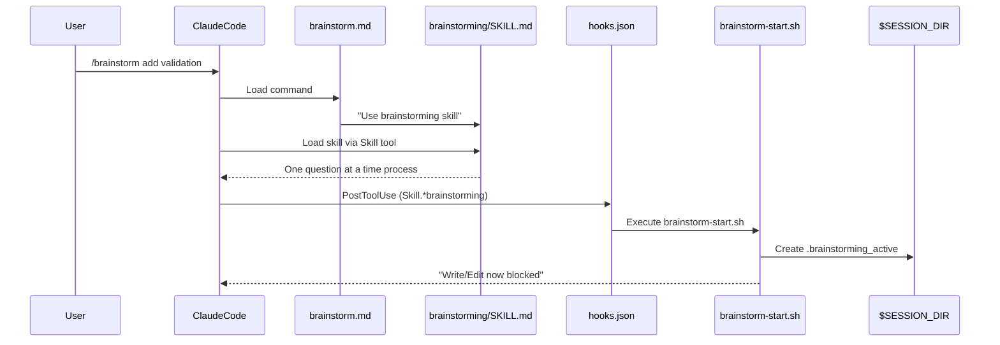
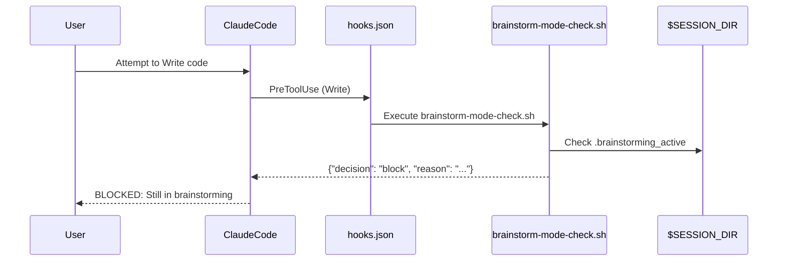
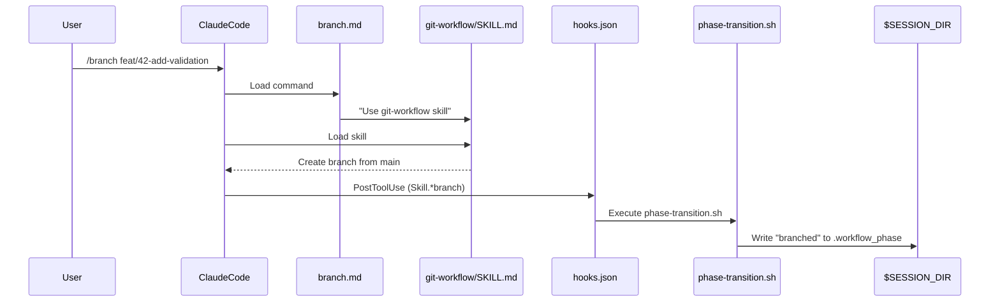
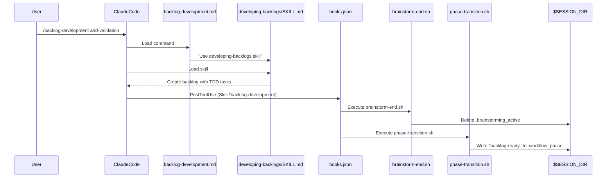
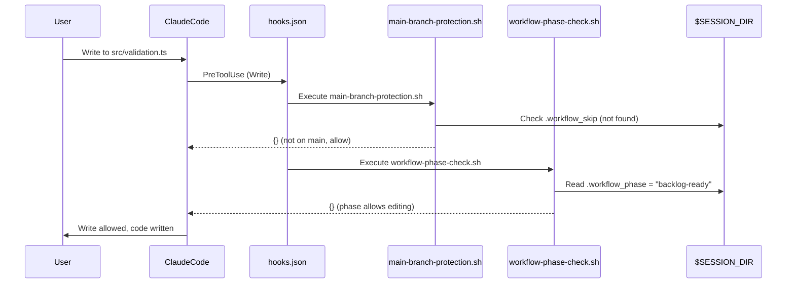
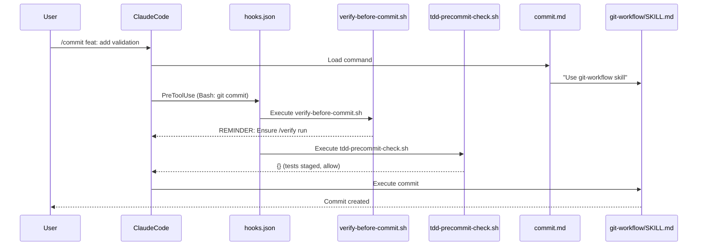

# Beginner Pattern: First Feature with Guided Workflow

## Scenario Overview

A first-time user implements a feature using the guided workflow. They follow the full command sequence but do **manual implementation** (no subagent orchestration). This pattern demonstrates:

- How the plugin enforces workflow discipline
- How hooks block premature actions
- How state transitions through phases
- The minimum viable workflow

## Command Sequence

```
/brainstorm → /branch → /backlog-development → [manual edit] → /verify → /commit
```

---

## Phase 1: Session Start

When a new session begins, the plugin automatically injects context.

### What Happens



### Files Activated

```
User starts session
     │
     ▼
┌─────────────────────────────────────────────────────────────────────┐
│ hooks/hooks.json (lines 3-12)                                       │
│                                                                     │
│   "SessionStart": [                                                 │
│     {                                                               │
│       "matcher": "startup|resume|clear|compact",                    │
│       "hooks": [                                                    │
│         { "command": "session-start.sh" }                           │
│       ]                                                             │
│     }                                                               │
│   ]                                                                 │
└─────────────────────────────────────────────────────────────────────┘
     │
     ▼
┌─────────────────────────────────────────────────────────────────────┐
│ hooks/session-start.sh (lines 1-44)                                 │
│                                                                     │
│   Line 11: Reads skills/using-ecosystem/SKILL.md                    │
│   Lines 14-30: Escapes content for JSON                             │
│   Lines 35-41: Outputs additionalContext with skill content         │
└─────────────────────────────────────────────────────────────────────┘
     │
     ▼
┌─────────────────────────────────────────────────────────────────────┐
│ skills/using-ecosystem/SKILL.md                                     │
│                                                                     │
│   Full ecosystem documentation injected into Claude's context       │
│   - Lists all skills, commands, agents                              │
│   - Explains workflow phases and enforcement                        │
│   - Provides quick reference tables                                 │
└─────────────────────────────────────────────────────────────────────┘
```

### State After Phase 1

| State File | Value |
|------------|-------|
| `.workflow_phase` | Not created yet (idle) |
| `.brainstorming_active` | Not created |
| `.workflow_skip` | Not created |

---

## Phase 2: Brainstorm (`/brainstorm`)

User types `/brainstorm` to explore requirements before implementation.

### What Happens



### Files Activated

```
User types: /brainstorm add validation
     │
     ▼
┌─────────────────────────────────────────────────────────────────────┐
│ commands/brainstorm.md (lines 1-21)                                 │
│                                                                     │
│   Line 2: description: "Explore requirements and design..."        │
│   Line 20: "Use the **brainstorming** skill..."                     │
│                                                                     │
│   This command is a thin wrapper - it tells Claude to invoke        │
│   the brainstorming skill.                                          │
└─────────────────────────────────────────────────────────────────────┘
     │
     ▼
┌─────────────────────────────────────────────────────────────────────┐
│ skills/brainstorming/SKILL.md (lines 1-252)                         │
│                                                                     │
│   Line 12: "Core principle: Understand completely before            │
│             implementing anything."                                 │
│   Lines 51-71: Phase 2 - Explore Requirements                       │
│     - Ask questions one at a time                                   │
│     - Prefer multiple choice                                        │
│   Lines 72-98: Phase 3 - Propose 2-3 Approaches                     │
│   Lines 100-106: Phase 4 - Present Design Incrementally             │
│   Lines 112-117: Save to docs/designs/YYYY-MM-DD-<topic>-design.md  │
└─────────────────────────────────────────────────────────────────────┘
     │
     ▼ PostToolUse hook fires (matcher: Skill.*brainstorming)
┌─────────────────────────────────────────────────────────────────────┐
│ hooks/hooks.json (lines 56-63)                                      │
│                                                                     │
│   "PostToolUse": [                                                  │
│     {                                                               │
│       "matcher": "Skill.*brainstorming",                            │
│       "hooks": [                                                    │
│         { "command": "brainstorm-start.sh" }                        │
│       ]                                                             │
│     }                                                               │
│   ]                                                                 │
└─────────────────────────────────────────────────────────────────────┘
     │
     ▼
┌─────────────────────────────────────────────────────────────────────┐
│ hooks/brainstorm-start.sh (lines 1-22)                              │
│                                                                     │
│   Lines 6-8: Create session directory if needed                     │
│   Line 12: touch "$MARKER_FILE" (.brainstorming_active)             │
│   Lines 14-20: Output "BRAINSTORMING MODE ACTIVE: Write/Edit        │
│                tools are now blocked..."                            │
└─────────────────────────────────────────────────────────────────────┘
```

### What If User Tries to Write/Edit Now?



The hook `brainstorm-mode-check.sh` reads the `.brainstorming_active` marker and returns a block decision.

### State After Phase 2

| State File | Value |
|------------|-------|
| `.workflow_phase` | `brainstorming` (via phase-transition.sh) |
| `.brainstorming_active` | Created (blocks Write/Edit) |
| `.workflow_skip` | Not created |

---

## Phase 3: Create Branch (`/branch`)

User types `/branch feat/42-add-validation` to create a feature branch.

### What Happens



### Files Activated

```
User types: /branch feat/42-add-validation
     │
     ▼
┌─────────────────────────────────────────────────────────────────────┐
│ commands/branch.md (lines 1-19)                                     │
│                                                                     │
│   Line 2: description: "Create or switch to a feature branch..."   │
│   Line 18: "Use the **git-workflow** skill..."                      │
└─────────────────────────────────────────────────────────────────────┘
     │
     ▼
┌─────────────────────────────────────────────────────────────────────┐
│ skills/git-workflow/SKILL.md                                        │
│                                                                     │
│   Branch naming conventions: <type>/<issue>-<description>           │
│   Checks for uncommitted changes first                              │
│   Creates branch from main/master                                   │
└─────────────────────────────────────────────────────────────────────┘
     │
     ▼ PostToolUse hook fires (matcher: Skill.*(git-workflow|branch))
┌─────────────────────────────────────────────────────────────────────┐
│ hooks/hooks.json (lines 74-81)                                      │
│                                                                     │
│   {                                                                 │
│     "matcher": "Skill.*(git-workflow|branch)",                      │
│     "hooks": [                                                      │
│       { "command": "phase-transition.sh" }                          │
│     ]                                                               │
│   }                                                                 │
└─────────────────────────────────────────────────────────────────────┘
     │
     ▼
┌─────────────────────────────────────────────────────────────────────┐
│ hooks/phase-transition.sh (lines 1-58)                              │
│                                                                     │
│   Lines 20-41: Case statement matching skill invoked                │
│   Lines 25-27: *git-workflow*|*branch* → NEW_PHASE="branched"       │
│   Lines 44-52: Write phase to .workflow_phase, output message       │
└─────────────────────────────────────────────────────────────────────┘
```

### State After Phase 3

| State File | Value |
|------------|-------|
| `.workflow_phase` | `branched` |
| `.brainstorming_active` | Still exists (Write/Edit still blocked!) |
| `.workflow_skip` | Not created |

**Note**: Write/Edit is STILL blocked in the `branched` phase because the user hasn't created a backlog yet.

---

## Phase 4: Create Backlog (`/backlog-development`)

User types `/backlog-development add-validation` to create a bite-sized backlog.

### What Happens



### Files Activated

```
User types: /backlog-development add-validation
     │
     ▼
┌─────────────────────────────────────────────────────────────────────┐
│ commands/backlog-development.md (lines 1-19)                        │
│                                                                     │
│   Line 2: description: "Create a bite-sized backlog..."            │
│   Line 18: "Use the **developing-backlogs** skill..."               │
└─────────────────────────────────────────────────────────────────────┘
     │
     ▼
┌─────────────────────────────────────────────────────────────────────┐
│ skills/developing-backlogs/SKILL.md                                 │
│                                                                     │
│   Creates tasks with:                                               │
│   - Exact file paths                                                │
│   - Complete code (not "add validation")                            │
│   - Test commands with expected output                              │
│   - TDD cycle: test → fail → implement → pass → commit              │
│                                                                     │
│   Saves to: docs/backlogs/YYYY-MM-DD-<feature>-backlog.md           │
└─────────────────────────────────────────────────────────────────────┘
     │
     ▼ PostToolUse hook fires (matcher: Skill.*(backlog-development|developing-backlogs))
┌─────────────────────────────────────────────────────────────────────┐
│ hooks/hooks.json (lines 65-72)                                      │
│                                                                     │
│   {                                                                 │
│     "matcher": "Skill.*(backlog-development|developing-backlogs)",  │
│     "hooks": [                                                      │
│       { "command": "brainstorm-end.sh" }                            │
│     ]                                                               │
│   }                                                                 │
└─────────────────────────────────────────────────────────────────────┘
     │
     ▼
┌─────────────────────────────────────────────────────────────────────┐
│ hooks/brainstorm-end.sh (lines 1-25)                                │
│                                                                     │
│   Lines 6-8: Check session directory                                │
│   Lines 10-11: If .brainstorming_active exists, delete it           │
│   Lines 12-18: Output "BRAINSTORMING MODE ENDED..."                 │
└─────────────────────────────────────────────────────────────────────┘
     │
     ▼ Also fires phase-transition.sh (same pattern)
┌─────────────────────────────────────────────────────────────────────┐
│ hooks/phase-transition.sh (lines 29-31)                             │
│                                                                     │
│   *developing-backlogs*|*backlog-development* → "backlog-ready"     │
│   Writes "backlog-ready" to .workflow_phase                         │
└─────────────────────────────────────────────────────────────────────┘
```

### State After Phase 4

| State File | Value |
|------------|-------|
| `.workflow_phase` | `backlog-ready` |
| `.brainstorming_active` | **Deleted** (Write/Edit now ALLOWED!) |
| `.workflow_skip` | Not created |

**Now Write/Edit tools are unblocked** because the phase is `backlog-ready`.

---

## Phase 5: Manual Implementation

User implements the feature manually (no `/implement` subagent orchestration). They write code and tests following TDD.

### What Happens When User Writes Code



### Files Checked (but allow)

```
User writes: src/validation.ts
     │
     ▼ PreToolUse hooks fire (matcher: Write|Edit)
┌─────────────────────────────────────────────────────────────────────┐
│ hooks/hooks.json (lines 28-43)                                      │
│                                                                     │
│   {                                                                 │
│     "matcher": "Write|Edit",                                        │
│     "hooks": [                                                      │
│       { "command": "main-branch-protection.sh" },                   │
│       { "command": "workflow-phase-check.sh" },                     │
│       { "command": "brainstorm-mode-check.sh" }                     │
│     ]                                                               │
│   }                                                                 │
└─────────────────────────────────────────────────────────────────────┘
     │
     ▼
┌─────────────────────────────────────────────────────────────────────┐
│ hooks/main-branch-protection.sh (lines 1-46)                        │
│                                                                     │
│   Lines 15-21: Check for .workflow_skip (not found)                 │
│   Lines 23-28: Check if in git repo (yes)                           │
│   Lines 30-31: Get current branch (feat/42-add-validation)          │
│   Lines 33-40: NOT main or master → return {} (allow)               │
└─────────────────────────────────────────────────────────────────────┘
     │
     ▼
┌─────────────────────────────────────────────────────────────────────┐
│ hooks/workflow-phase-check.sh (lines 1-70)                          │
│                                                                     │
│   Lines 23-25: Read .workflow_phase = "backlog-ready"               │
│   Lines 54-56: backlog-ready|implementing|verifying → return {}     │
│                (these phases allow editing)                         │
└─────────────────────────────────────────────────────────────────────┘
     │
     ▼
┌─────────────────────────────────────────────────────────────────────┐
│ hooks/brainstorm-mode-check.sh                                      │
│                                                                     │
│   Checks for .brainstorming_active marker                           │
│   Marker deleted in Phase 4 → return {} (allow)                     │
└─────────────────────────────────────────────────────────────────────┘
     │
     ▼
All checks pass → Write/Edit ALLOWED
```

---

## Phase 6: Verify (`/verify`)

User types `/verify` before committing to ensure everything passes.

### Files Activated

```
User types: /verify
     │
     ▼
┌─────────────────────────────────────────────────────────────────────┐
│ commands/verify.md (lines 1-19)                                     │
│                                                                     │
│   Line 2: description: "Run pre-completion verification..."        │
│   Line 18: "Use the **verification** skill..."                      │
└─────────────────────────────────────────────────────────────────────┘
     │
     ▼
┌─────────────────────────────────────────────────────────────────────┐
│ skills/verification/SKILL.md                                        │
│                                                                     │
│   THE IRON LAW: No claims without evidence                          │
│   - Run ALL tests: must show output                                 │
│   - Run linter: must show 0 errors                                  │
│   - Run type checker: must show no issues                           │
│   - Run build: must succeed                                         │
│   - "Should pass" is FORBIDDEN                                      │
└─────────────────────────────────────────────────────────────────────┘
     │
     ▼ PostToolUse hook fires (matcher: Skill.*(verification|verify))
┌─────────────────────────────────────────────────────────────────────┐
│ hooks/phase-transition.sh (lines 37-39)                             │
│                                                                     │
│   *verification*|*verify* → NEW_PHASE="verifying"                   │
│   Writes "verifying" to .workflow_phase                             │
└─────────────────────────────────────────────────────────────────────┘
```

### State After Phase 6

| State File | Value |
|------------|-------|
| `.workflow_phase` | `verifying` |
| `.brainstorming_active` | Deleted |
| `.workflow_skip` | Not created |

---

## Phase 7: Commit (`/commit`)

User types `/commit` after verification passes.

### What Happens



### Files Activated

```
User types: /commit feat: add validation
     │
     ▼
┌─────────────────────────────────────────────────────────────────────┐
│ commands/commit.md (lines 1-19)                                     │
│                                                                     │
│   Line 2: description: "Create an atomic commit..."                │
│   Line 18: "Use the **git-workflow** skill..."                      │
└─────────────────────────────────────────────────────────────────────┘
     │
     ▼
┌─────────────────────────────────────────────────────────────────────┐
│ skills/git-workflow/SKILL.md                                        │
│                                                                     │
│   Atomic commits: one logical change per commit                     │
│   Conventional format: type: description                            │
│   Includes co-author line for Claude                                │
└─────────────────────────────────────────────────────────────────────┘
     │
     ▼ PreToolUse hooks fire (matcher: Bash)
┌─────────────────────────────────────────────────────────────────────┐
│ hooks/hooks.json (lines 16-26)                                      │
│                                                                     │
│   {                                                                 │
│     "matcher": "Bash",                                              │
│     "hooks": [                                                      │
│       { "command": "verify-before-commit.sh" },                     │
│       { "command": "tdd-precommit-check.sh" }                       │
│     ]                                                               │
│   }                                                                 │
└─────────────────────────────────────────────────────────────────────┘
     │
     ▼
┌─────────────────────────────────────────────────────────────────────┐
│ hooks/verify-before-commit.sh (lines 1-25)                          │
│                                                                     │
│   Lines 9-10: Check if command contains "git commit"                │
│   Lines 12-18: Output REMINDER about verification                   │
│   (Non-blocking - just adds context)                                │
└─────────────────────────────────────────────────────────────────────┘
     │
     ▼
┌─────────────────────────────────────────────────────────────────────┐
│ hooks/tdd-precommit-check.sh (lines 1-64)                           │
│                                                                     │
│   Lines 9-13: Check if command is git commit                        │
│   Lines 29-35: Get staged files                                     │
│   Lines 37-48: Check if source files have corresponding tests       │
│   Lines 50-59: If untested source files → BLOCK                     │
│   (In this case, tests are staged → allow)                          │
└─────────────────────────────────────────────────────────────────────┘
```

---

## Summary: Files Referenced in Beginner Pattern

### Commands (5 of 8)
- [x] `commands/brainstorm.md`
- [x] `commands/branch.md`
- [x] `commands/backlog-development.md`
- [x] `commands/verify.md`
- [x] `commands/commit.md`
- [ ] `commands/implement.md` (Intermediate pattern)
- [ ] `commands/pr.md` (Intermediate pattern)
- [ ] `commands/workflow.md` (Expert pattern)

### Skills (6 of 12)
- [x] `skills/using-ecosystem/SKILL.md`
- [x] `skills/brainstorming/SKILL.md`
- [x] `skills/developing-backlogs/SKILL.md`
- [x] `skills/git-workflow/SKILL.md`
- [x] `skills/verification/SKILL.md`
- [ ] `skills/orchestrating-subagents/SKILL.md` (Intermediate pattern)
- [ ] `skills/workflow-management/SKILL.md` (Expert pattern)
- [ ] `skills/subagent-state-management/SKILL.md` (Intermediate pattern)
- [ ] `skills/systematic-debugging/SKILL.md` (Intermediate pattern)
- [ ] `skills/python-development/SKILL.md` (Intermediate pattern)
- [ ] `skills/typescript-development/SKILL.md` (Expert pattern)
- [ ] `skills/angular-development/SKILL.md` (Expert pattern)

### Agents (0 of 3)
- [ ] `agents/code-implementer.md` (Intermediate pattern)
- [ ] `agents/spec-reviewer.md` (Intermediate pattern)
- [ ] `agents/quality-reviewer.md` (Intermediate pattern)

### Hooks (12 of 13)
- [x] `hooks/hooks.json`
- [x] `hooks/run-hook.cmd` (implicit, used by all hooks)
- [x] `hooks/session-start.sh`
- [x] `hooks/main-branch-protection.sh`
- [x] `hooks/workflow-phase-check.sh`
- [x] `hooks/brainstorm-mode-check.sh`
- [x] `hooks/brainstorm-start.sh`
- [x] `hooks/brainstorm-end.sh`
- [x] `hooks/phase-transition.sh`
- [x] `hooks/tdd-precommit-check.sh`
- [x] `hooks/verify-before-commit.sh`
- [ ] `hooks/validate-task-description.sh` (Intermediate pattern)
- [ ] `hooks/workflow-skip-set.sh` (Expert pattern)

### State Files Used
- [x] `.workflow_phase` (created, modified)
- [x] `.brainstorming_active` (created, deleted)
- [ ] `.workflow_skip` (not used in beginner pattern)
- [ ] `.backlog_path` (optional)

---

## Key Takeaways for Beginners

1. **The workflow is enforced**: You can't skip steps because hooks actively block premature actions.

2. **State is tracked via files**: The session directory contains marker files that control what's allowed.

3. **Commands are thin wrappers**: Each command just points to a skill - the skill contains the actual logic.

4. **Hooks fire automatically**: You don't call hooks directly - they fire based on tool usage patterns.

5. **Phase transitions are automatic**: When you complete one step, the system automatically advances to the next phase.

6. **TDD is enforced at commit time**: If you try to commit source files without tests, the commit is blocked.

---

## Next Steps

After completing the beginner workflow, explore:
- [Intermediate Pattern](./intermediate-pattern.md): Full automation with subagent orchestration
- [Expert Pattern](./expert-pattern.md): Power user customization and escape hatches
