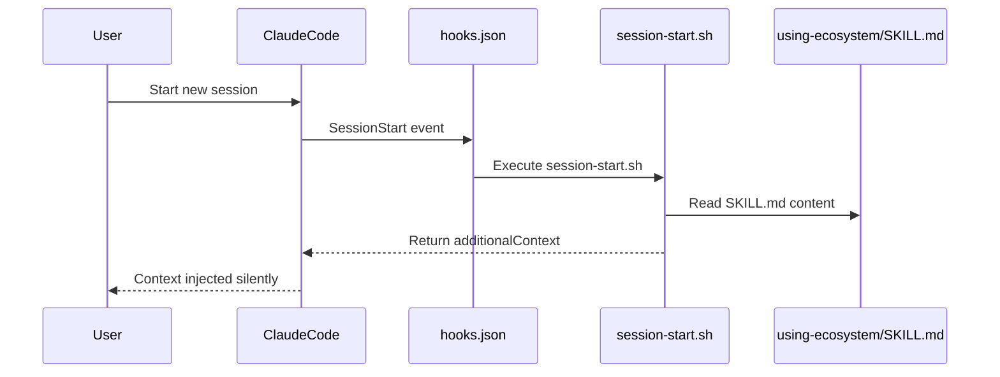
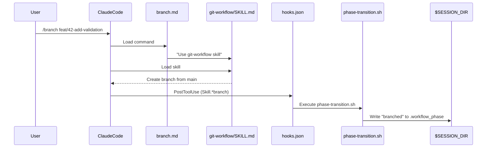
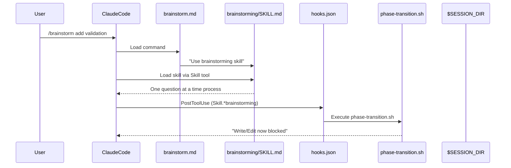
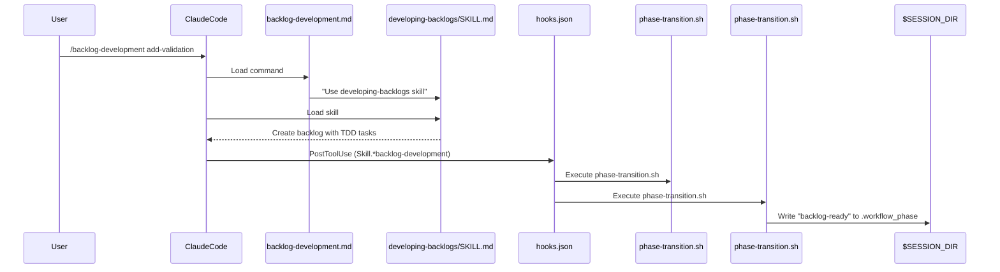
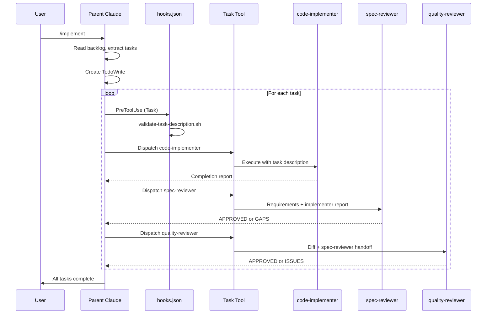
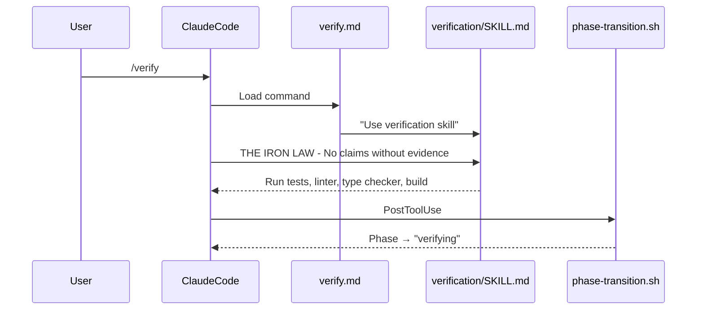
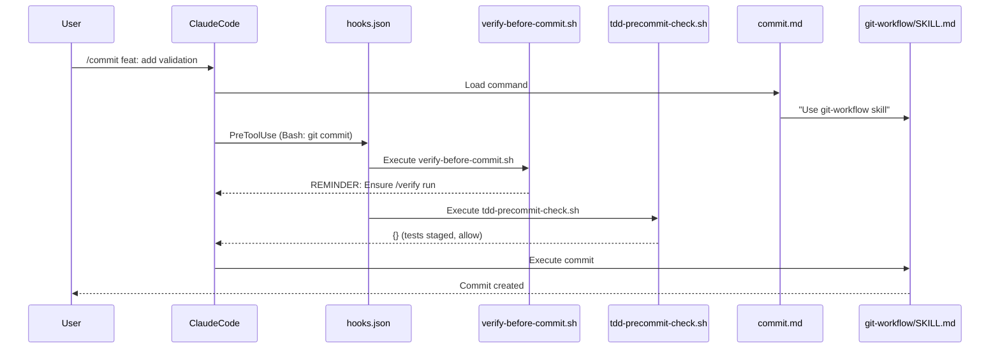
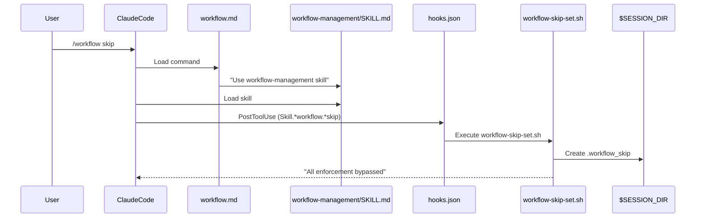

# Expert Pattern: Power User Workflow Customization

## Scenario Overview

A power user understands the workflow deeply and uses advanced features:
- **Escape hatches** to bypass enforcement when appropriate
- **Direct skill invocation** for precise control
- **Language-specific skills** for project-appropriate patterns
- **Custom task descriptions** for optimal subagent performance
- **Release scripts** for plugin maintenance

This pattern covers advanced workflow features and demonstrates when and how experts deviate from the standard workflow while maintaining the complete workflow reference inline.

---

## Complete Workflow Reference (Phases 1-7)

Experts know the full workflow and can reference any phase. This section provides the complete file traces for quick reference.

### Phase 1: Session Start



**Files Activated:**
```
hooks/hooks.json → hooks/session-start.sh → skills/using-ecosystem/SKILL.md
```

| State File | Value |
|------------|-------|
| `.workflow_phase` | Not created yet (idle) |
| `.workflow_skip` | Not created |

---

### Phase 2: Create Branch (`/branch`)



**Files Activated:**
```
commands/branch.md → skills/git-workflow/SKILL.md
PostToolUse: hooks/hooks.json → hooks/phase-transition.sh
```

| State File | Value |
|------------|-------|
| `.workflow_phase` | `branched` |
| `.workflow_skip` | Not created |

---

### Phase 3: Brainstorm (`/brainstorm`)

> **Tip**: This command works best in plan mode (shift+tab twice) for efficient codebase research with Explore/Plan agents.



**Files Activated:**
```
commands/brainstorm.md → skills/brainstorming/SKILL.md
PostToolUse: hooks/hooks.json → hooks/phase-transition.sh
```

| State File | Value |
|------------|-------|
| `.workflow_phase` | `brainstorming` |
| `.workflow_skip` | Not created |

---

### Phase 4: Create Backlog (`/backlog-development`)

> **Tip**: Also benefits from plan mode—creating backlogs with exact file paths and complete code requires codebase exploration.



**Files Activated:**
```
commands/backlog-development.md → skills/developing-backlogs/SKILL.md
PostToolUse: hooks/phase-transition.sh, hooks/phase-transition.sh
```

| State File | Value |
|------------|-------|
| `.workflow_phase` | `backlog-ready` |
| `.workflow_skip` | Not created |

---

### Phase 5: Implement (`/implement`)



**Files Activated:**
```
commands/implement.md → skills/orchestrating-subagents/SKILL.md
PreToolUse: hooks/validate-task-description.sh
Agents: agents/code-implementer.md, agents/spec-reviewer.md, agents/quality-reviewer.md
Agent Skills: skills/subagent-state-management/SKILL.md, skills/systematic-debugging/SKILL.md
Language Skills: skills/python-development/SKILL.md, skills/typescript-development/SKILL.md
```

| State File | Value |
|------------|-------|
| `.workflow_phase` | `implementing` |
| `.workflow_skip` | Not created |

---

### Phase 6: Verify (`/verify`)



**Files Activated:**
```
commands/verify.md → skills/verification/SKILL.md
PostToolUse: hooks/phase-transition.sh
```

| State File | Value |
|------------|-------|
| `.workflow_phase` | `verifying` |

---

### Phase 7: Commit and PR (`/commit`, `/pr`)

**Commit Flow:**


**PR Flow:**
```
commands/pr.md → skills/git-workflow/SKILL.md → templates/pr-description.md
```

**Files Activated:**
```
commands/commit.md, commands/pr.md → skills/git-workflow/SKILL.md
PreToolUse: hooks/verify-before-commit.sh, hooks/tdd-precommit-check.sh
Template: templates/pr-description.md
```

---

## Escape Hatch: `/workflow skip`

Experts know when strict workflow enforcement is counterproductive and can bypass it.

### When to Use Skip

| Scenario | Standard Workflow | Expert Approach |
|----------|------------------|-----------------|
| Quick hotfix | Full branch → brainstorm → backlog | `/workflow skip` → direct fix |
| Exploration/learning | Blocked by enforcement | `/workflow skip` → experiment freely |
| Documentation-only changes | Blocked by TDD | `/workflow skip` → write docs |
| Known-good pattern | Full planning | `/workflow skip` → apply pattern |

### What Happens



### Files Activated

```
User types: /workflow skip
     │
     ▼
┌─────────────────────────────────────────────────────────────────────┐
│ commands/workflow.md (lines 1-19)                                   │
│                                                                     │
│   Line 2: description: "Manage workflow enforcement state"         │
│   Line 3: argument-hint: "<subcommand> (skip|status|reset)"         │
│   Line 18: "Use the **workflow-management** skill..."               │
└─────────────────────────────────────────────────────────────────────┘
     │
     ▼
┌─────────────────────────────────────────────────────────────────────┐
│ skills/workflow-management/SKILL.md (lines 1-127)                   │
│                                                                     │
│   Lines 19-40: Skip Enforcement                                     │
│     - When to use: experienced users, quick fixes, exploration      │
│     - Effect: Creates .workflow_skip marker                         │
│     - Lasts until session ends or reset                             │
│   Lines 42-66: Check Status                                         │
│     - Shows phase, branch, skip mode, backlog                       │
│   Lines 68-86: Reset State                                          │
│     - Removes all markers, returns to idle                          │
│   Lines 99-115: Workflow phases and transitions                     │
└─────────────────────────────────────────────────────────────────────┘
     │
     ▼ PostToolUse hook fires (matcher: Skill.*workflow.*skip)
┌─────────────────────────────────────────────────────────────────────┐
│ hooks/hooks.json (lines 101-108)                                    │
│                                                                     │
│   {                                                                 │
│     "matcher": "Skill.*workflow.*skip",                             │
│     "hooks": [                                                      │
│       { "command": "workflow-skip-set.sh" }                         │
│     ]                                                               │
│   }                                                                 │
└─────────────────────────────────────────────────────────────────────┘
     │
     ▼
┌─────────────────────────────────────────────────────────────────────┐
│ hooks/workflow-skip-set.sh (lines 1-31)                             │
│                                                                     │
│   Lines 9-13: Check if this is a workflow skip command              │
│   Lines 15-17: Create session directory if needed                   │
│   Lines 19-21: Create .workflow_skip marker                         │
│   Lines 23-29: Output message with reminder about TDD/quality       │
└─────────────────────────────────────────────────────────────────────┘
```

### How Skip Affects Blocking Hooks

After `/workflow skip`, all blocking hooks check for the skip marker and allow the action:

```
PreToolUse hook: main-branch-protection.sh
     │
     ▼
     Check for .workflow_skip marker
     │
     ├── Found → return {} (allow)
     │
     └── Not found → continue with normal checks
```

This applies to:
- `main-branch-protection.sh` (line 17-20)
- `workflow-phase-check.sh` (line 17-20)
- `tdd-precommit-check.sh` (line 17-20)

---

## Language-Specific Skills

Experts invoke language skills directly for project-appropriate patterns.

### TypeScript Development

```
Expert works on TypeScript project
     │
     ▼
┌─────────────────────────────────────────────────────────────────────┐
│ skills/typescript-development/SKILL.md (lines 1-284)                │
│                                                                     │
│   Lines 10-22: Environment setup                                    │
│     - TypeScript >=5.0, Node.js >=20                                │
│     - pnpm > npm > yarn                                             │
│   Lines 57-71: Strict tsconfig.json                                 │
│     - strict: true, noUncheckedIndexedAccess: true                  │
│   Lines 73-104: Interfaces vs Types                                 │
│     - Interfaces for objects, types for unions                      │
│   Lines 106-135: Discriminated unions for state                     │
│   Lines 137-155: Avoid any, use unknown + type guards               │
│   Lines 208-255: Error handling patterns                            │
│     - Custom error classes                                          │
│     - Result pattern for expected errors                            │
└─────────────────────────────────────────────────────────────────────┘
```

### Angular Development

```
Expert works on Angular project
     │
     ▼
┌─────────────────────────────────────────────────────────────────────┐
│ skills/angular-development/SKILL.md (lines 1-300)                   │
│                                                                     │
│   Lines 12-31: Discovery-first approach                             │
│     - Detect existing patterns before applying                      │
│     - Check for standalone vs NgModule                              │
│     - Detect state management (Signals, RxJS, NgRx)                 │
│   Lines 63-108: State management patterns                           │
│     - Signals pattern (signal, computed, effect)                    │
│     - RxJS service pattern (BehaviorSubject)                        │
│   Lines 110-162: Component standards                                │
│     - Standalone components, modern control flow                    │
│     - @if, @for with track, @switch, @defer                         │
│   Lines 164-206: Performance patterns                               │
│     - OnPush change detection                                       │
│     - Track functions for @for                                      │
│     - Lazy loading routes                                           │
│   Lines 208-235: Subscription management                            │
│     - takeUntilDestroyed, async pipe                                │
└─────────────────────────────────────────────────────────────────────┘
```

### When to Invoke Language Skills

Experts invoke language skills in task descriptions for subagents:

```markdown
### Required Skills
- `typescript-development` - TypeScript patterns and strict mode
- `angular-development` - Angular 17+ patterns and state management
- `verification` - Before claiming completion
```

This ensures subagents follow project-appropriate patterns.

---

## Release Process

Experts maintain the plugin using the release scripts.

### Release Script

```
Expert prepares a release
     │
     ▼
┌─────────────────────────────────────────────────────────────────────┐
│ scripts/release.sh (lines 1-91)                                     │
│                                                                     │
│   Lines 10-21: Validate version argument (semver format)            │
│   Lines 23-33: Check version is different and tag doesn't exist     │
│   Lines 41-45: Check for uncommitted changes                        │
│   Lines 47-61: Update version in both plugin.json and marketplace.json │
│   Lines 65-70: Commit version bump and create tag                   │
│   Lines 72-90: Optionally push to origin with tags                  │
└─────────────────────────────────────────────────────────────────────┘
     │
     ▼ Updates
┌─────────────────────────────────────────────────────────────────────┐
│ .claude-plugin/plugin.json                                          │
│                                                                     │
│   Plugin manifest - version field updated                           │
└─────────────────────────────────────────────────────────────────────┘
     │
┌─────────────────────────────────────────────────────────────────────┐
│ .claude-plugin/marketplace.json                                     │
│                                                                     │
│   Marketplace metadata - version field updated                      │
│   Must stay in sync with plugin.json                                │
└─────────────────────────────────────────────────────────────────────┘
```

### Pre-Push Version Check

```
Expert pushes to origin
     │
     ▼
┌─────────────────────────────────────────────────────────────────────┐
│ scripts/pre-push-version-check.sh (lines 1-88)                      │
│                                                                     │
│   Lines 15-26: Check plugin.json and marketplace.json match         │
│   Lines 30-47: Check for commits since last tag                     │
│   Lines 52-84: Validate version was incremented for real changes    │
│     - If code changed but version same → ERROR                      │
│     - If version bumped but no tag → ERROR                          │
└─────────────────────────────────────────────────────────────────────┘
```

### Usage Example

```bash
# Prepare release
./scripts/release.sh 1.8.0

# Script updates:
# - .claude-plugin/plugin.json (version field)
# - .claude-plugin/marketplace.json (version field)
# - Creates commit: "chore(release): bump version to 1.8.0"
# - Creates tag: v1.8.0

# Push to publish
git push origin master --tags
```

---

## Direct Skill Invocation

Experts invoke skills directly via the Skill tool for precise control.

### Example: Direct Debugging Skill

```
Expert encounters error during implementation
     │
     ▼
┌─────────────────────────────────────────────────────────────────────┐
│ skills/systematic-debugging/SKILL.md                                │
│                                                                     │
│   4-phase methodology:                                              │
│   1. Investigation - Gather symptoms, reproduce consistently        │
│   2. Pattern Analysis - What changed? Similar issues?               │
│   3. Hypothesis Testing - One change at a time                      │
│   4. Implementation - Fix root cause, add regression test           │
│                                                                     │
│   Key principle: ALWAYS find root cause, NEVER fix symptoms         │
└─────────────────────────────────────────────────────────────────────┘
```

### Example: Direct Subagent State Management

```
Expert dispatches custom subagent
     │
     ▼
┌─────────────────────────────────────────────────────────────────────┐
│ skills/subagent-state-management/SKILL.md                           │
│                                                                     │
│   Session startup ritual:                                           │
│   - Environment verification (git status, tests)                    │
│   - Context orientation (Purpose, Requirements, Files)              │
│   - Scope confirmation (ask if unclear)                             │
│                                                                     │
│   Progress documentation patterns                                   │
│   State recovery from git                                           │
│   Handoff protocols between agents                                  │
└─────────────────────────────────────────────────────────────────────┘
```

---

## Custom Task Descriptions

Experts craft optimized task descriptions for specific situations.

### Enhanced Task Description

From `orchestrating-subagents/SKILL.md` lines 136-211, experts include all enhanced sections:

```markdown
## Task: Implement rate limiting middleware

### Purpose
Prevent abuse by limiting API requests per user. This protects our infrastructure
and ensures fair access for all users. Reduces support tickets about slow responses
during traffic spikes.

### Context
This is task 2 of 4 in implementing API security.
Previous tasks completed: Authentication middleware
This task builds on: Authentication (uses user ID for per-user limits)

### Requirements
- Limit to 100 requests per minute per authenticated user
- Limit to 10 requests per minute for unauthenticated requests
- Return 429 Too Many Requests with Retry-After header
- Log rate limit violations for monitoring

### Environment Verification
```bash
pytest tests/api/ -x -q --tb=short
curl -X GET http://localhost:3000/health
```

### Files
Create: src/middleware/rate-limiter.ts, tests/middleware/rate-limiter.test.ts
Modify: src/app.ts (register middleware)

### Success Criteria
- Rate limiting kicks in at threshold
- 429 response includes Retry-After header
- Logs include user ID and endpoint
- Tests cover authenticated and unauthenticated paths

### Potential Failure Modes
- Redis connection failure: Need fallback behavior (allow or deny?)
- Clock skew: Use server time, not client time
- Header parsing: Validate X-Forwarded-For before trusting
- Memory leak: Ensure Redis connections are properly pooled

### Required Skills
- `typescript-development` - TypeScript patterns
- `systematic-debugging` - If Redis issues
- `verification` - Before claiming completion

### Conventions
- Use existing middleware pattern from auth-middleware.ts
- Follow established error response format
- Use winston for logging (existing logger)

---
This is a fresh task context. Previous task context does not apply.
```

---

## Expert Workflow Examples

### Example 1: Quick Hotfix

```bash
# Normal user: Would be blocked on main branch
# Expert: Bypass enforcement

User: "There's a typo in the error message, quick fix needed"

/workflow skip   # Bypass all enforcement
# Edit the file directly
/commit fix: correct typo in error message
```

### Example 2: TypeScript Project with Angular

```bash
# Expert invokes language skills in task description

User: "Implement a new dashboard component"

# Expert prepares task description with:
### Required Skills
- `typescript-development` - Strict mode, explicit types
- `angular-development` - Signals, OnPush, modern control flow
- `verification` - Before completion

# Subagent receives Angular-appropriate patterns automatically
```

### Example 3: Release New Plugin Version

```bash
# Expert maintains the plugin

./scripts/release.sh 1.8.1
# Updates plugin.json and marketplace.json
# Commits and tags

git push origin master --tags
# Pre-push hook validates version consistency
```

---

## Summary: All Files Referenced

This expert pattern is self-contained with complete file references.

### Commands (8 of 8)
- [x] `commands/brainstorm.md` - Requirements exploration
- [x] `commands/branch.md` - Feature branch creation
- [x] `commands/backlog-development.md` - Backlog creation
- [x] `commands/implement.md` - Subagent orchestration
- [x] `commands/verify.md` - Pre-completion verification
- [x] `commands/commit.md` - Atomic commits
- [x] `commands/pr.md` - Pull request creation
- [x] `commands/workflow.md` - Enforcement management (skip/status/reset)

### Skills (12 of 12)
- [x] `skills/using-ecosystem/SKILL.md` - Ecosystem orientation
- [x] `skills/brainstorming/SKILL.md` - Requirements exploration
- [x] `skills/developing-backlogs/SKILL.md` - Backlog creation
- [x] `skills/orchestrating-subagents/SKILL.md` - Subagent dispatch
- [x] `skills/verification/SKILL.md` - Evidence-based completion
- [x] `skills/git-workflow/SKILL.md` - Branch/commit/PR
- [x] `skills/workflow-management/SKILL.md` - State management
- [x] `skills/subagent-state-management/SKILL.md` - Agent startup/handoff
- [x] `skills/systematic-debugging/SKILL.md` - Debugging methodology
- [x] `skills/python-development/SKILL.md` - Python standards
- [x] `skills/typescript-development/SKILL.md` - TypeScript patterns
- [x] `skills/angular-development/SKILL.md` - Angular patterns

### Agents (3 of 3)
- [x] `agents/code-implementer.md` - TDD implementation
- [x] `agents/spec-reviewer.md` - Requirements compliance
- [x] `agents/quality-reviewer.md` - Code quality assessment

### Hooks (13 of 13)
- [x] `hooks/hooks.json` - Hook configuration
- [x] `hooks/run-hook.cmd` - Cross-platform execution
- [x] `hooks/session-start.sh` - Inject ecosystem context
- [x] `hooks/main-branch-protection.sh` - **BLOCKS** edits on main/master
- [x] `hooks/workflow-phase-check.sh` - **BLOCKS** edits before backlog
- [x] `hooks/phase-transition.sh` - Set brainstorming marker
- [x] `hooks/phase-transition.sh` - Clear brainstorming marker
- [x] `hooks/phase-transition.sh` - Update workflow phase
- [x] `hooks/tdd-precommit-check.sh` - **BLOCKS** commits without tests
- [x] `hooks/verify-before-commit.sh` - Verification reminder
- [x] `hooks/validate-task-description.sh` - Validate task descriptions
- [x] `hooks/workflow-skip-set.sh` - Set skip marker

### Templates (1 of 1)
- [x] `templates/pr-description.md` - PR template

### Scripts (2 of 2)
- [x] `scripts/release.sh` - Version bump and tag
- [x] `scripts/pre-push-version-check.sh` - Version sync validation

### Plugin Config (2 of 2)
- [x] `.claude-plugin/plugin.json` - Plugin manifest
- [x] `.claude-plugin/marketplace.json` - Marketplace metadata

---

## Key Takeaways for Expert Users

1. **Know when to skip**: `/workflow skip` is powerful but comes with responsibility.

2. **Language skills matter**: Include appropriate language skills in task descriptions for project-specific patterns.

3. **Complete task descriptions**: Enhanced sections (Purpose, Failure Modes, Skills) significantly improve subagent performance.

4. **Maintain the plugin**: Use `release.sh` for version management and understand pre-push validation.

5. **Direct skill invocation**: For precise control, invoke skills directly via the Skill tool.

6. **Understand the hooks**: Knowing which hooks fire when enables expert-level workflow customization.

---

## Complete File Coverage

All 41 core plugin files are referenced in this pattern:

| Category | Count |
|----------|-------|
| Commands | 8/8 |
| Skills | 12/12 |
| Agents | 3/3 |
| Hooks | 13/13 |
| Templates | 1/1 |
| Scripts | 2/2 |
| Plugin Config | 2/2 |

See [file-reference-matrix.md](./file-reference-matrix.md) for the complete matrix and analysis.
