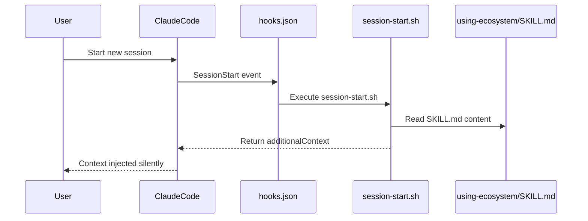
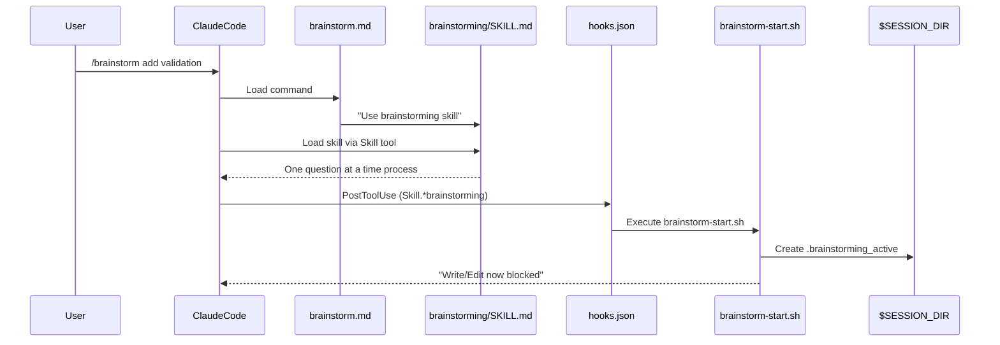
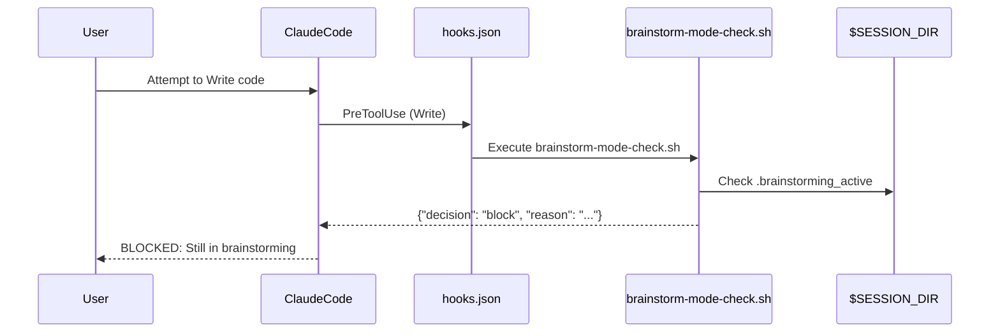
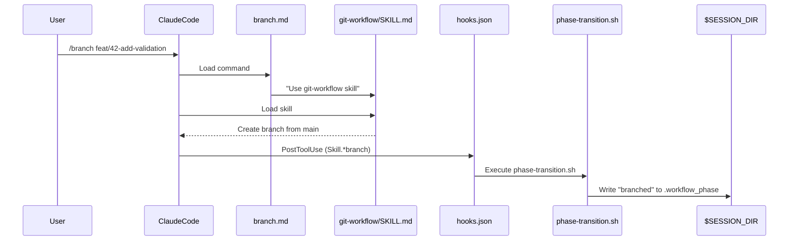
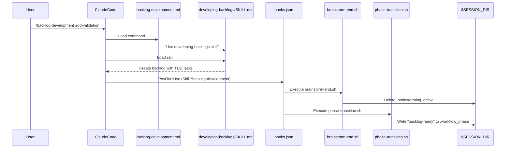
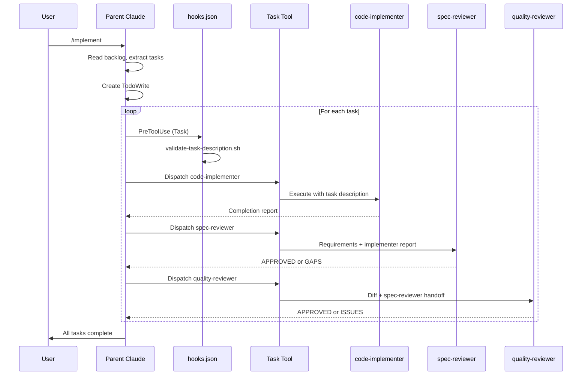
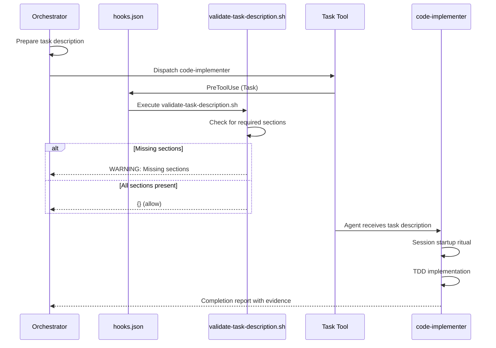
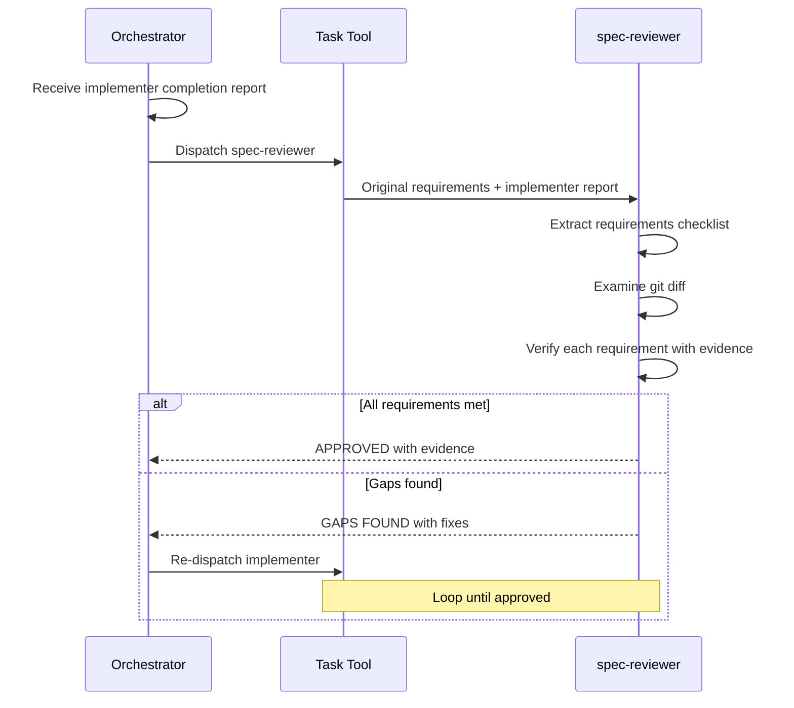
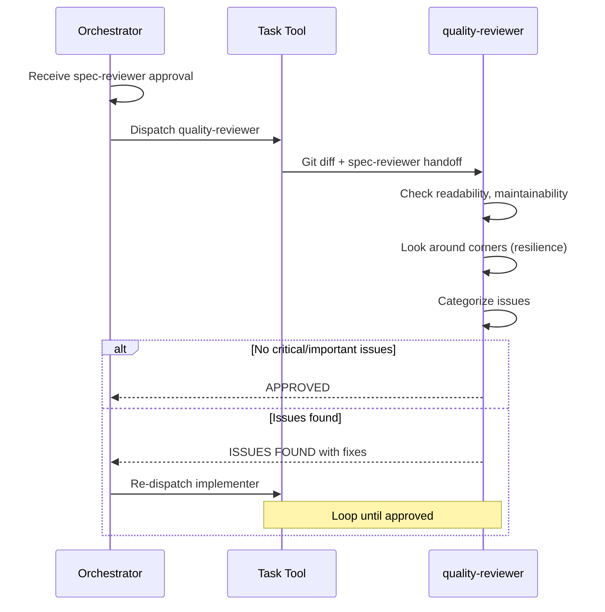

# Intermediate Pattern: Full Automation with Subagent Orchestration

## Scenario Overview

A user familiar with the workflow uses **full automation** with subagent orchestration. They follow the complete command sequence and let specialized agents handle implementation, spec review, and quality review. This pattern demonstrates:

- How the `/implement` command orchestrates subagents
- How task descriptions communicate with subagents
- The two-stage review process (spec-reviewer → quality-reviewer)
- Review loops when issues are found
- Full workflow from brainstorm to PR

## Command Sequence

```
/brainstorm → /branch → /backlog-development → /implement → /verify → /pr
```

---

## Phase 1: Session Start

When a new session begins, the plugin automatically injects context.

### What Happens



### Files Activated

```
User starts session
     │
     ▼
┌─────────────────────────────────────────────────────────────────────┐
│ hooks/hooks.json (lines 3-12)                                       │
│                                                                     │
│   "SessionStart": [                                                 │
│     {                                                               │
│       "matcher": "startup|resume|clear|compact",                    │
│       "hooks": [                                                    │
│         { "command": "session-start.sh" }                           │
│       ]                                                             │
│     }                                                               │
│   ]                                                                 │
└─────────────────────────────────────────────────────────────────────┘
     │
     ▼
┌─────────────────────────────────────────────────────────────────────┐
│ hooks/session-start.sh (lines 1-44)                                 │
│                                                                     │
│   Line 11: Reads skills/using-ecosystem/SKILL.md                    │
│   Lines 14-30: Escapes content for JSON                             │
│   Lines 35-41: Outputs additionalContext with skill content         │
└─────────────────────────────────────────────────────────────────────┘
     │
     ▼
┌─────────────────────────────────────────────────────────────────────┐
│ skills/using-ecosystem/SKILL.md                                     │
│                                                                     │
│   Full ecosystem documentation injected into Claude's context       │
│   - Lists all skills, commands, agents                              │
│   - Explains workflow phases and enforcement                        │
│   - Provides quick reference tables                                 │
└─────────────────────────────────────────────────────────────────────┘
```

### State After Phase 1

| State File | Value |
|------------|-------|
| `.workflow_phase` | Not created yet (idle) |
| `.brainstorming_active` | Not created |
| `.workflow_skip` | Not created |

---

## Phase 2: Brainstorm (`/brainstorm`)

User types `/brainstorm` to explore requirements before implementation.

### What Happens



### Files Activated

```
User types: /brainstorm add validation
     │
     ▼
┌─────────────────────────────────────────────────────────────────────┐
│ commands/brainstorm.md (lines 1-21)                                 │
│                                                                     │
│   Line 2: description: "Explore requirements and design..."        │
│   Line 20: "Use the **brainstorming** skill..."                     │
│                                                                     │
│   This command is a thin wrapper - it tells Claude to invoke        │
│   the brainstorming skill.                                          │
└─────────────────────────────────────────────────────────────────────┘
     │
     ▼
┌─────────────────────────────────────────────────────────────────────┐
│ skills/brainstorming/SKILL.md (lines 1-252)                         │
│                                                                     │
│   Line 12: "Core principle: Understand completely before            │
│             implementing anything."                                 │
│   Lines 51-71: Phase 2 - Explore Requirements                       │
│     - Ask questions one at a time                                   │
│     - Prefer multiple choice                                        │
│   Lines 72-98: Phase 3 - Propose 2-3 Approaches                     │
│   Lines 100-106: Phase 4 - Present Design Incrementally             │
│   Lines 112-117: Save to docs/designs/YYYY-MM-DD-<topic>-design.md  │
└─────────────────────────────────────────────────────────────────────┘
     │
     ▼ PostToolUse hook fires (matcher: Skill.*brainstorming)
┌─────────────────────────────────────────────────────────────────────┐
│ hooks/hooks.json (lines 56-63)                                      │
│                                                                     │
│   "PostToolUse": [                                                  │
│     {                                                               │
│       "matcher": "Skill.*brainstorming",                            │
│       "hooks": [                                                    │
│         { "command": "brainstorm-start.sh" }                        │
│       ]                                                             │
│     }                                                               │
│   ]                                                                 │
└─────────────────────────────────────────────────────────────────────┘
     │
     ▼
┌─────────────────────────────────────────────────────────────────────┐
│ hooks/brainstorm-start.sh (lines 1-22)                              │
│                                                                     │
│   Lines 6-8: Create session directory if needed                     │
│   Line 12: touch "$MARKER_FILE" (.brainstorming_active)             │
│   Lines 14-20: Output "BRAINSTORMING MODE ACTIVE: Write/Edit        │
│                tools are now blocked..."                            │
└─────────────────────────────────────────────────────────────────────┘
```

### What If User Tries to Write/Edit Now?



The hook `brainstorm-mode-check.sh` reads the `.brainstorming_active` marker and returns a block decision.

### State After Phase 2

| State File | Value |
|------------|-------|
| `.workflow_phase` | `brainstorming` (via phase-transition.sh) |
| `.brainstorming_active` | Created (blocks Write/Edit) |
| `.workflow_skip` | Not created |

---

## Phase 3: Create Branch (`/branch`)

User types `/branch feat/42-add-validation` to create a feature branch.

### What Happens



### Files Activated

```
User types: /branch feat/42-add-validation
     │
     ▼
┌─────────────────────────────────────────────────────────────────────┐
│ commands/branch.md (lines 1-19)                                     │
│                                                                     │
│   Line 2: description: "Create or switch to a feature branch..."   │
│   Line 18: "Use the **git-workflow** skill..."                      │
└─────────────────────────────────────────────────────────────────────┘
     │
     ▼
┌─────────────────────────────────────────────────────────────────────┐
│ skills/git-workflow/SKILL.md                                        │
│                                                                     │
│   Branch naming conventions: <type>/<issue>-<description>           │
│   Checks for uncommitted changes first                              │
│   Creates branch from main/master                                   │
└─────────────────────────────────────────────────────────────────────┘
     │
     ▼ PostToolUse hook fires (matcher: Skill.*(git-workflow|branch))
┌─────────────────────────────────────────────────────────────────────┐
│ hooks/hooks.json (lines 74-81)                                      │
│                                                                     │
│   {                                                                 │
│     "matcher": "Skill.*(git-workflow|branch)",                      │
│     "hooks": [                                                      │
│       { "command": "phase-transition.sh" }                          │
│     ]                                                               │
│   }                                                                 │
└─────────────────────────────────────────────────────────────────────┘
     │
     ▼
┌─────────────────────────────────────────────────────────────────────┐
│ hooks/phase-transition.sh (lines 1-58)                              │
│                                                                     │
│   Lines 20-41: Case statement matching skill invoked                │
│   Lines 25-27: *git-workflow*|*branch* → NEW_PHASE="branched"       │
│   Lines 44-52: Write phase to .workflow_phase, output message       │
└─────────────────────────────────────────────────────────────────────┘
```

### State After Phase 3

| State File | Value |
|------------|-------|
| `.workflow_phase` | `branched` |
| `.brainstorming_active` | Still exists (Write/Edit still blocked!) |
| `.workflow_skip` | Not created |

**Note**: Write/Edit is STILL blocked in the `branched` phase because the user hasn't created a backlog yet.

---

## Phase 4: Create Backlog (`/backlog-development`)

User types `/backlog-development add-validation` to create a bite-sized backlog.

### What Happens



### Files Activated

```
User types: /backlog-development add-validation
     │
     ▼
┌─────────────────────────────────────────────────────────────────────┐
│ commands/backlog-development.md (lines 1-19)                        │
│                                                                     │
│   Line 2: description: "Create a bite-sized backlog..."            │
│   Line 18: "Use the **developing-backlogs** skill..."               │
└─────────────────────────────────────────────────────────────────────┘
     │
     ▼
┌─────────────────────────────────────────────────────────────────────┐
│ skills/developing-backlogs/SKILL.md                                 │
│                                                                     │
│   Creates tasks with:                                               │
│   - Exact file paths                                                │
│   - Complete code (not "add validation")                            │
│   - Test commands with expected output                              │
│   - TDD cycle: test → fail → implement → pass → commit              │
│                                                                     │
│   Saves to: docs/backlogs/YYYY-MM-DD-<feature>-backlog.md           │
└─────────────────────────────────────────────────────────────────────┘
     │
     ▼ PostToolUse hook fires (matcher: Skill.*(backlog-development|developing-backlogs))
┌─────────────────────────────────────────────────────────────────────┐
│ hooks/hooks.json (lines 65-72)                                      │
│                                                                     │
│   {                                                                 │
│     "matcher": "Skill.*(backlog-development|developing-backlogs)",  │
│     "hooks": [                                                      │
│       { "command": "brainstorm-end.sh" }                            │
│     ]                                                               │
│   }                                                                 │
└─────────────────────────────────────────────────────────────────────┘
     │
     ▼
┌─────────────────────────────────────────────────────────────────────┐
│ hooks/brainstorm-end.sh (lines 1-25)                                │
│                                                                     │
│   Lines 6-8: Check session directory                                │
│   Lines 10-11: If .brainstorming_active exists, delete it           │
│   Lines 12-18: Output "BRAINSTORMING MODE ENDED..."                 │
└─────────────────────────────────────────────────────────────────────┘
     │
     ▼ Also fires phase-transition.sh (same pattern)
┌─────────────────────────────────────────────────────────────────────┐
│ hooks/phase-transition.sh (lines 29-31)                             │
│                                                                     │
│   *developing-backlogs*|*backlog-development* → "backlog-ready"     │
│   Writes "backlog-ready" to .workflow_phase                         │
└─────────────────────────────────────────────────────────────────────┘
```

### State After Phase 4

| State File | Value |
|------------|-------|
| `.workflow_phase` | `backlog-ready` |
| `.brainstorming_active` | **Deleted** (Write/Edit now ALLOWED!) |
| `.workflow_skip` | Not created |

**Now Write/Edit tools are unblocked** because the phase is `backlog-ready`.

---

## Phase 5: Implement (`/implement`)

This is where the Intermediate Pattern diverges. User types `/implement` to execute the backlog with subagent orchestration.

### What Happens (High-Level)



### Files Activated in Phase 5

```
User types: /implement
     │
     ▼
┌─────────────────────────────────────────────────────────────────────┐
│ commands/implement.md (lines 1-90)                                  │
│                                                                     │
│   Line 2: description: "Execute a backlog using orchestrated        │
│            subagents with two-stage review"                         │
│   Lines 17-35: Environment verification before starting             │
│   Lines 37-53: Task description preparation guidance                │
│   Lines 65-80: Execution flow overview                              │
│   Line 67: "Use the **orchestrating-subagents** skill..."           │
└─────────────────────────────────────────────────────────────────────┘
     │
     ▼
┌─────────────────────────────────────────────────────────────────────┐
│ skills/orchestrating-subagents/SKILL.md (lines 1-388)               │
│                                                                     │
│   Lines 14-53: The Orchestration Pattern                            │
│   Lines 62-69: Subagent roles table                                 │
│   Lines 136-190: Task Description Format                            │
│   Lines 192-211: Task Description Checklist                         │
│   Lines 229-251: Review Loop Pattern                                │
│   Lines 335-350: Mandatory Task Tool Usage                          │
└─────────────────────────────────────────────────────────────────────┘
     │
     ▼ PostToolUse hook fires (matcher: Skill.*(orchestrating|implement))
┌─────────────────────────────────────────────────────────────────────┐
│ hooks/hooks.json (lines 83-90)                                      │
│                                                                     │
│   {                                                                 │
│     "matcher": "Skill.*(orchestrating|implement)",                  │
│     "hooks": [                                                      │
│       { "command": "phase-transition.sh" }                          │
│     ]                                                               │
│   }                                                                 │
└─────────────────────────────────────────────────────────────────────┘
     │
     ▼
┌─────────────────────────────────────────────────────────────────────┐
│ hooks/phase-transition.sh (lines 33-35)                             │
│                                                                     │
│   *orchestrating*|*implement* → NEW_PHASE="implementing"            │
│   Writes "implementing" to .workflow_phase                          │
└─────────────────────────────────────────────────────────────────────┘
```

---

## Phase 5a: Dispatching code-implementer

When the orchestrator dispatches the code-implementer agent for each task.

### What Happens



### Files Activated

```
Orchestrator prepares task description and dispatches
     │
     ▼ PreToolUse hook fires (matcher: Task)
┌─────────────────────────────────────────────────────────────────────┐
│ hooks/hooks.json (lines 45-52)                                      │
│                                                                     │
│   {                                                                 │
│     "matcher": "Task",                                              │
│     "hooks": [                                                      │
│       { "command": "validate-task-description.sh" }                   │
│     ]                                                               │
│   }                                                                 │
└─────────────────────────────────────────────────────────────────────┘
     │
     ▼
┌─────────────────────────────────────────────────────────────────────┐
│ hooks/validate-task-description.sh (lines 1-99)                       │
│                                                                     │
│   Lines 11-15: Only checks Task tool calls                          │
│   Lines 17-21: Only checks subagent dispatches                      │
│   Lines 23-27: Only checks implementer/reviewer agents              │
│   Lines 29-48: Checks core sections:                                │
│     - Task header                                                   │
│     - Context section                                               │
│     - Requirements section                                          │
│     - Success Criteria                                              │
│   Lines 50-65: Checks enhanced sections:                            │
│     - Purpose (WHY task matters)                                    │
│     - Environment Verification                                      │
│     - Potential Failure Modes                                       │
│     - Required Skills                                               │
│   Lines 67-93: Build and output warning message                     │
└─────────────────────────────────────────────────────────────────────┘
     │
     ▼ code-implementer agent is dispatched
┌─────────────────────────────────────────────────────────────────────┐
│ agents/code-implementer.md (lines 1-423)                            │
│                                                                     │
│   Lines 9-17: Role and principles                                   │
│     - Build with Purpose                                            │
│     - Look Around Corners                                           │
│     - Inspire Trust                                                 │
│   Lines 19-52: Session Startup Ritual                               │
│     - Environment verification                                      │
│     - Context orientation                                           │
│     - Scope confirmation                                            │
│   Lines 68-86: TDD is Mandatory                                     │
│     - Write test → Watch fail → Implement → Pass → Refactor         │
│   Lines 88-98: Self-review before handoff                           │
│   Lines 107-167: Error handling protocol                            │
│   Lines 187-221: Completion verification with evidence              │
│   Lines 271-309: Completion report format                           │
└─────────────────────────────────────────────────────────────────────┘
     │
     ▼ Agent references additional skills
┌─────────────────────────────────────────────────────────────────────┐
│ skills/subagent-state-management/SKILL.md                           │
│                                                                     │
│   Session startup patterns                                          │
│   Progress documentation                                            │
│   State recovery                                                    │
│   Handoff protocols                                                 │
└─────────────────────────────────────────────────────────────────────┘
     │
     ▼ If stuck on error
┌─────────────────────────────────────────────────────────────────────┐
│ skills/systematic-debugging/SKILL.md                                │
│                                                                     │
│   4-phase debugging methodology:                                    │
│   1. Investigation                                                  │
│   2. Pattern Analysis                                               │
│   3. Hypothesis Testing                                             │
│   4. Implementation                                                 │
└─────────────────────────────────────────────────────────────────────┘
     │
     ▼ If Python project
┌─────────────────────────────────────────────────────────────────────┐
│ skills/python-development/SKILL.md                                  │
│                                                                     │
│   Python 3.12+, uv (not pip), ruff, mypy, pytest                    │
│   Type hints, pathlib, dataclasses                                  │
└─────────────────────────────────────────────────────────────────────┘
```

### Task Description Example

The orchestrator prepares a task description like this (from `orchestrating-subagents/SKILL.md` lines 140-190):

```markdown
## Task: Add email validation

### Purpose
Prevent invalid email addresses from being registered, reducing user friction
and support tickets from typos in email addresses.

### Context
This is task 3 of 5 in implementing user-registration.
Previous tasks completed: User model, password hashing
This task builds on: User model schema

### Requirements
- Validate email format on blur
- Show inline error message for invalid format
- Allow form submission only with valid email

### Environment Verification
```bash
pytest tests/ -x -q --tb=short
npm run build
```

### Files
Create: src/validators/email.ts, tests/validators/email.test.ts
Modify: src/components/RegistrationForm.tsx

### Success Criteria
- Invalid email shows error message
- Valid email allows form submission
- Tests cover both cases

### Potential Failure Modes
- Regex too strict (rejects valid emails)
- Regex too loose (accepts invalid emails)
- Error message not visible to screen readers

### Required Skills
- `typescript-development` - TypeScript patterns
- `verification` - Before claiming completion

---
This is a fresh task context. Previous task context does not apply.
```

---

## Phase 5b: Dispatching spec-reviewer

After code-implementer returns a completion report, the orchestrator dispatches spec-reviewer.

### What Happens



### Files Activated

```
Orchestrator dispatches spec-reviewer
     │
     ▼
┌─────────────────────────────────────────────────────────────────────┐
│ agents/spec-reviewer.md (lines 1-390)                               │
│                                                                     │
│   Lines 9-17: Role definition                                       │
│     - Compare implementation against requirements                   │
│     - Verify with evidence                                          │
│     - "Close enough" is not enough                                  │
│   Lines 43-107: Review process                                      │
│     1. Understand requirements (extract checklist)                  │
│     2. Examine implementation (git diff)                            │
│     3. Verify each requirement with evidence                        │
│     4. Check for over-implementation                                │
│   Lines 119-145: Incomplete implementation detection                │
│     - Red flags: TODO comments, tests pass but don't test requirement│
│   Lines 147-155: "Close enough" is NOT enough                       │
│   Lines 157-186: Output: APPROVED                                   │
│   Lines 188-229: Output: GAPS FOUND                                 │
│   Lines 267-296: Handoff to quality-reviewer                        │
└─────────────────────────────────────────────────────────────────────┘
```

### Review Loop Pattern

If spec-reviewer finds gaps (from `orchestrating-subagents/SKILL.md` lines 229-251):

```
┌─────────────────────────┐
│ Dispatch spec-reviewer  │
└───────────┬─────────────┘
            │
            ▼
     ┌──────────────┐
     │ Gaps found?  │
     └──────┬───────┘
            │
     yes ───┼─── no
            │      │
            ▼      ▼
     ┌──────────┐  ┌──────────┐
     │Impl fixes│  │ APPROVED │
     └────┬─────┘  └──────────┘
          │
          └──► Re-dispatch spec-reviewer
```

---

## Phase 5c: Dispatching quality-reviewer

After spec-reviewer approves, the orchestrator dispatches quality-reviewer.

### What Happens



### Files Activated

```
Orchestrator dispatches quality-reviewer
     │
     ▼
┌─────────────────────────────────────────────────────────────────────┐
│ agents/quality-reviewer.md (lines 1-436)                            │
│                                                                     │
│   Lines 9-19: Role definition                                       │
│     - HOW the code is written, not WHAT it does                     │
│     - Look around corners                                           │
│   Lines 22-54: Scope boundary                                       │
│     - What to check vs what NOT to check                            │
│     - Do NOT re-check requirements (spec-reviewer's job)            │
│   Lines 94-130: Quality lens                                        │
│     - Readability, maintainability, resilience, patterns            │
│   Lines 131-149: Categorize issues                                  │
│     - Critical (must fix): security, data corruption, leaks         │
│     - Important (should fix): maintainability, patterns             │
│     - Minor (nice to fix): style, naming                            │
│   Lines 158-197: Resilience assessment                              │
│     - What happens if this fails?                                   │
│     - What happens at boundaries?                                   │
│     - What resources need cleanup?                                  │
│   Lines 199-230: Output: APPROVED                                   │
│   Lines 232-297: Output: ISSUES FOUND                               │
│   Lines 343-388: Actionable issue reporting                         │
└─────────────────────────────────────────────────────────────────────┘
```

---

## Phase 6: Verify (`/verify`)

After all tasks complete, user runs `/verify` for final validation.

### Files Activated

```
User types: /verify
     │
     ▼
┌─────────────────────────────────────────────────────────────────────┐
│ commands/verify.md (lines 1-19)                                     │
│                                                                     │
│   Line 18: "Use the **verification** skill..."                      │
└─────────────────────────────────────────────────────────────────────┘
     │
     ▼
┌─────────────────────────────────────────────────────────────────────┐
│ skills/verification/SKILL.md                                        │
│                                                                     │
│   THE IRON LAW: No claims without evidence                          │
│   - Run ALL tests: must show output                                 │
│   - Run linter: must show 0 errors                                  │
│   - Run type checker: must show no issues                           │
│   - Run build: must succeed                                         │
└─────────────────────────────────────────────────────────────────────┘
     │
     ▼ PostToolUse hook
┌─────────────────────────────────────────────────────────────────────┐
│ hooks/phase-transition.sh (lines 37-39)                             │
│                                                                     │
│   *verification*|*verify* → NEW_PHASE="verifying"                   │
└─────────────────────────────────────────────────────────────────────┘
```

---

## Phase 7: Pull Request (`/pr`)

After verification passes, user creates a PR.

### Files Activated

```
User types: /pr
     │
     ▼
┌─────────────────────────────────────────────────────────────────────┐
│ commands/pr.md (lines 1-19)                                         │
│                                                                     │
│   Line 2: description: "Create a pull request with proper           │
│            template, linking to related issues"                     │
│   Line 18: "Use the **git-workflow** skill..."                      │
└─────────────────────────────────────────────────────────────────────┘
     │
     ▼
┌─────────────────────────────────────────────────────────────────────┐
│ skills/git-workflow/SKILL.md                                        │
│                                                                     │
│   PR creation with template                                         │
│   Issue linking (Closes #X)                                         │
│   Draft mode option                                                 │
└─────────────────────────────────────────────────────────────────────┘
     │
     ▼ Template referenced
┌─────────────────────────────────────────────────────────────────────┐
│ templates/pr-description.md                                         │
│                                                                     │
│   PR description template with sections:                            │
│   - Summary                                                         │
│   - Changes                                                         │
│   - Test Plan                                                       │
│   - Closes #X                                                       │
└─────────────────────────────────────────────────────────────────────┘
```

---

## Complete Flow Diagram

```mermaid
flowchart TD
    subgraph SessionStart
        S1[User starts session]
        S2[hooks.json]
        S3[session-start.sh]
        S4[using-ecosystem/SKILL.md]
        S1 --> S2 --> S3 --> S4
    end

    subgraph Brainstorm
        B1[/brainstorm]
        B2[brainstorm.md]
        B3[brainstorming/SKILL.md]
        B4[brainstorm-start.sh]
        B5[phase-transition.sh]
        B1 --> B2 --> B3
        B3 --> B4
        B3 --> B5
    end

    subgraph Branch
        BR1[/branch]
        BR2[branch.md]
        BR3[git-workflow/SKILL.md]
        BR4[phase-transition.sh]
        BR1 --> BR2 --> BR3 --> BR4
    end

    subgraph Backlog
        BK1[/backlog-development]
        BK2[backlog-development.md]
        BK3[developing-backlogs/SKILL.md]
        BK4[brainstorm-end.sh]
        BK5[phase-transition.sh]
        BK1 --> BK2 --> BK3
        BK3 --> BK4
        BK3 --> BK5
    end

    subgraph Implement
        I1[/implement]
        I2[implement.md]
        I3[orchestrating-subagents/SKILL.md]

        subgraph TaskLoop["For each task"]
            T1[validate-task-description.sh]
            T2[code-implementer.md]
            T3[subagent-state-management/SKILL.md]
            T4[python-development/SKILL.md]
            T5[spec-reviewer.md]
            T6[quality-reviewer.md]
        end

        I1 --> I2 --> I3
        I3 --> T1 --> T2
        T2 --> T3
        T2 --> T4
        T2 --> T5
        T5 --> T6
    end

    subgraph Verify
        V1[/verify]
        V2[verify.md]
        V3[verification/SKILL.md]
        V1 --> V2 --> V3
    end

    subgraph PR
        P1[/pr]
        P2[pr.md]
        P3[git-workflow/SKILL.md]
        P4[pr-description.md]
        P1 --> P2 --> P3 --> P4
    end

    SessionStart --> Brainstorm --> Branch --> Backlog --> Implement --> Verify --> PR
```

---

## Summary: Files Referenced in Intermediate Pattern

### Commands (7 of 8)
- [x] `commands/brainstorm.md`
- [x] `commands/branch.md`
- [x] `commands/backlog-development.md`
- [x] `commands/implement.md` **NEW**
- [x] `commands/verify.md`
- [x] `commands/commit.md` (within implementer flow)
- [x] `commands/pr.md` **NEW**
- [ ] `commands/workflow.md` (Expert pattern)

### Skills (9 of 12)
- [x] `skills/using-ecosystem/SKILL.md`
- [x] `skills/brainstorming/SKILL.md`
- [x] `skills/developing-backlogs/SKILL.md`
- [x] `skills/orchestrating-subagents/SKILL.md` **NEW**
- [x] `skills/verification/SKILL.md`
- [x] `skills/git-workflow/SKILL.md`
- [x] `skills/subagent-state-management/SKILL.md` **NEW**
- [x] `skills/systematic-debugging/SKILL.md` **NEW**
- [x] `skills/python-development/SKILL.md` **NEW**
- [ ] `skills/workflow-management/SKILL.md` (Expert pattern)
- [ ] `skills/typescript-development/SKILL.md` (Expert pattern)
- [ ] `skills/angular-development/SKILL.md` (Expert pattern)

### Agents (3 of 3)
- [x] `agents/code-implementer.md` **NEW**
- [x] `agents/spec-reviewer.md` **NEW**
- [x] `agents/quality-reviewer.md` **NEW**

### Hooks (13 of 13)
- [x] `hooks/hooks.json`
- [x] `hooks/run-hook.cmd`
- [x] `hooks/session-start.sh`
- [x] `hooks/main-branch-protection.sh`
- [x] `hooks/workflow-phase-check.sh`
- [x] `hooks/brainstorm-mode-check.sh`
- [x] `hooks/brainstorm-start.sh`
- [x] `hooks/brainstorm-end.sh`
- [x] `hooks/phase-transition.sh`
- [x] `hooks/tdd-precommit-check.sh`
- [x] `hooks/verify-before-commit.sh`
- [x] `hooks/validate-task-description.sh` **NEW**
- [ ] `hooks/workflow-skip-set.sh` (Expert pattern)

### Templates (1 of 1)
- [x] `templates/pr-description.md` **NEW**

---

## Key Takeaways for Intermediate Users

1. **Orchestration is the key**: The parent Claude reads the backlog once and dispatches fresh subagents per task.

2. **Task descriptions are the communication protocol**: Complete task descriptions (with Purpose, Failure Modes, Skills) ensure subagent success.

3. **Two-stage review ensures quality**: Spec compliance is checked before code quality.

4. **Review loops prevent issues**: If a reviewer finds problems, the implementer fixes them and the reviewer re-verifies.

5. **The validate-task-description hook helps**: It warns if your task description is missing sections.

6. **Agents reference skills**: Subagents consult language skills and debugging skills as needed.

7. **The workflow is strict but effective**: The structure ensures consistent, high-quality output.

---

## Next Steps

After mastering the intermediate workflow, explore:
- [Expert Pattern](./expert-pattern.md): Power user customization, escape hatches, and language-specific skills
