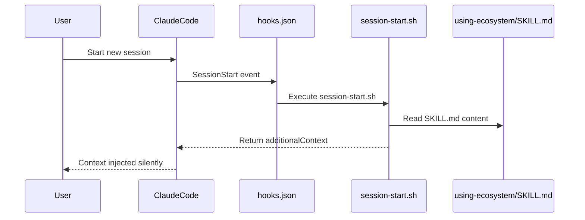
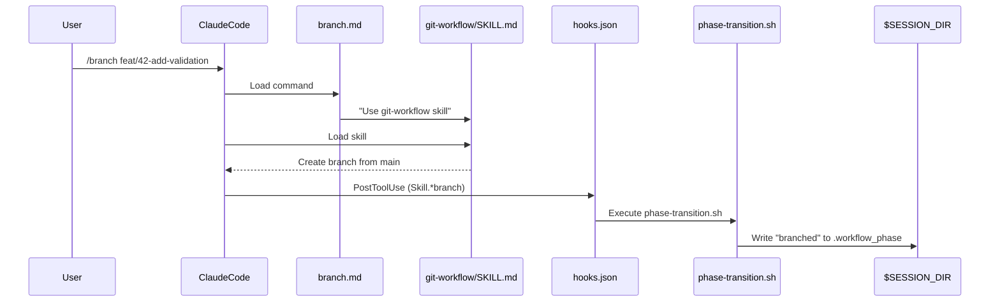
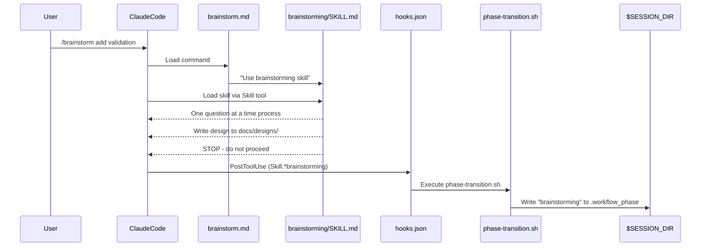
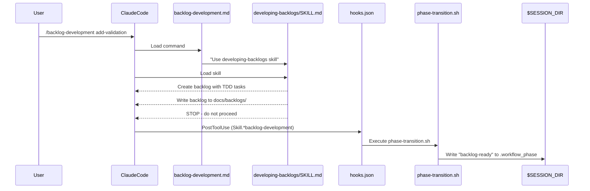
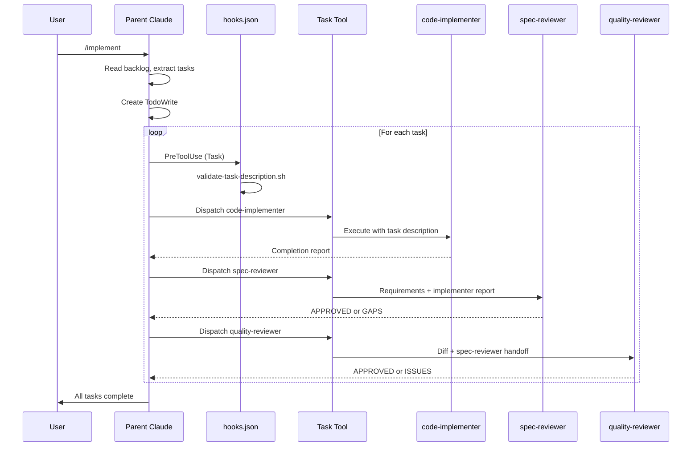
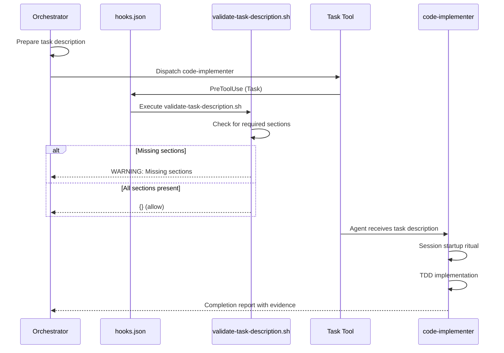
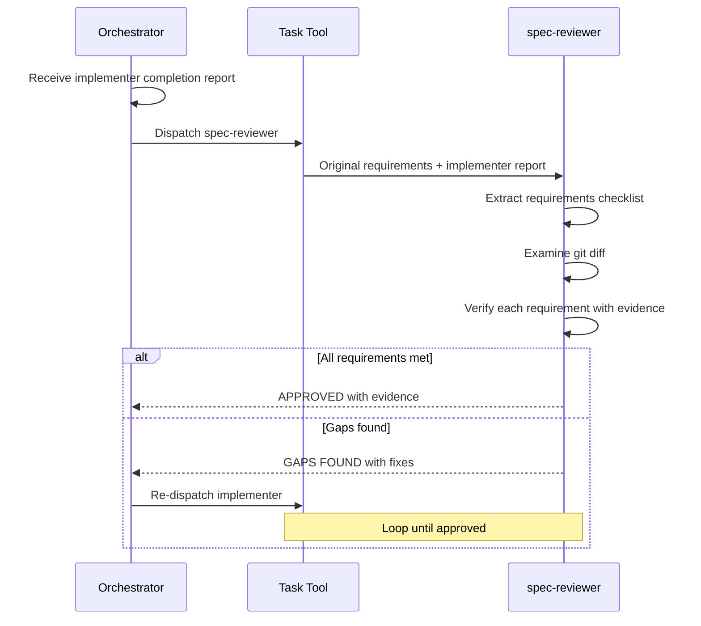
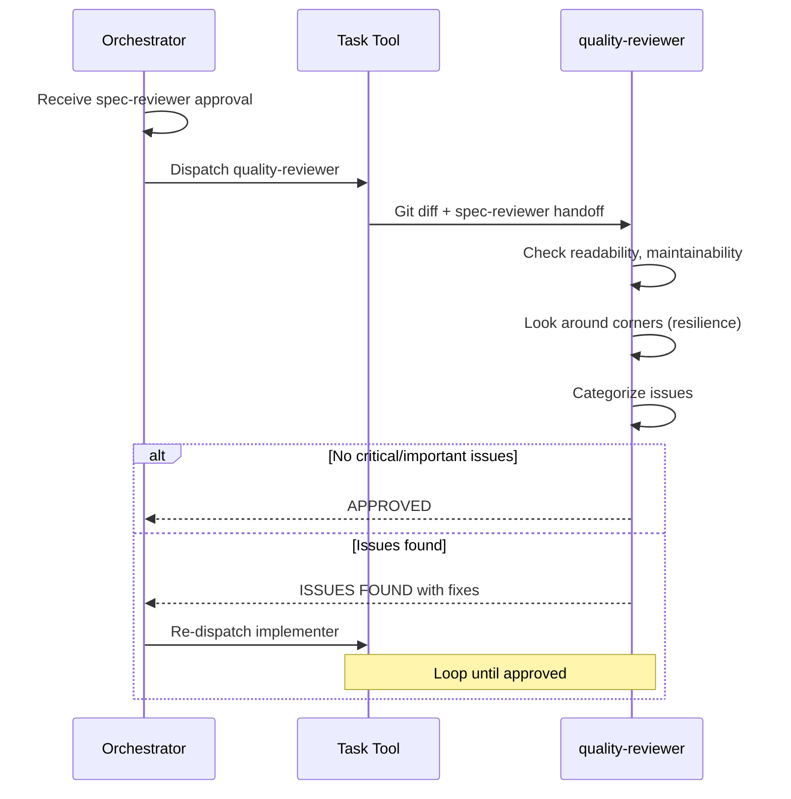

# Intermediate Pattern: Full Automation with Subagent Orchestration

## Scenario Overview

A user familiar with the workflow uses **full automation** with subagent orchestration. They follow the complete command sequence and let specialized agents handle implementation, spec review, and quality review. This pattern demonstrates:

- How the `/implement` command orchestrates subagents
- How task descriptions communicate with subagents
- The two-stage review process (spec-reviewer → quality-reviewer)
- Review loops when issues are found
- Full workflow from brainstorm to PR

## Command Sequence

```
/branch → /brainstorm (plan mode) → /backlog-development (plan mode) → /implement → /verify → /pr
```

---

## Phase 1: Session Start

When a new session begins, the plugin automatically injects context.

### What Happens



### Files Activated

```
User starts session
     │
     ▼
┌─────────────────────────────────────────────────────────────────────┐
│ hooks/hooks.json (lines 3-12)                                       │
│                                                                     │
│   "SessionStart": [                                                 │
│     {                                                               │
│       "matcher": "startup|resume|clear|compact",                    │
│       "hooks": [                                                    │
│         { "command": "session-start.sh" }                           │
│       ]                                                             │
│     }                                                               │
│   ]                                                                 │
└─────────────────────────────────────────────────────────────────────┘
     │
     ▼
┌─────────────────────────────────────────────────────────────────────┐
│ hooks/session-start.sh (lines 1-62)                                 │
│                                                                     │
│   Lines 16-26: Auto-detects feature branch, sets phase              │
│   Line 29: Reads skills/using-ecosystem/SKILL.md                    │
│   Lines 32-48: Escapes content for JSON                             │
│   Lines 53-61: Outputs additionalContext with skill content         │
└─────────────────────────────────────────────────────────────────────┘
     │
     ▼
┌─────────────────────────────────────────────────────────────────────┐
│ skills/using-ecosystem/SKILL.md                                     │
│                                                                     │
│   Full ecosystem documentation injected into Claude's context       │
│   - Lists all skills, commands, agents                              │
│   - Explains workflow phases and enforcement                        │
│   - Provides quick reference tables                                 │
└─────────────────────────────────────────────────────────────────────┘
```

### State After Phase 1

| State File | Value |
|------------|-------|
| `.workflow_phase` | Not created yet (idle) |
| `.workflow_skip` | Not created |

---

## Phase 2: Create Branch (`/branch`)

User types `/branch feat/42-add-validation` to create a feature branch. **This is the first step** - always branch before designing.

### What Happens



### Files Activated

```
User types: /branch feat/42-add-validation
     │
     ▼
┌─────────────────────────────────────────────────────────────────────┐
│ commands/branch.md (lines 1-18)                                     │
│                                                                     │
│   Line 2: description: "Create or switch to a feature branch..."   │
│   Line 18: "Use the **git-workflow** skill..."                      │
└─────────────────────────────────────────────────────────────────────┘
     │
     ▼
┌─────────────────────────────────────────────────────────────────────┐
│ skills/git-workflow/SKILL.md                                        │
│                                                                     │
│   Branch naming conventions: <type>/<issue>-<description>           │
│   Checks for uncommitted changes first                              │
│   Creates branch from main/master                                   │
└─────────────────────────────────────────────────────────────────────┘
     │
     ▼ PostToolUse hook fires (matcher: Skill.*(git-workflow|branch))
┌─────────────────────────────────────────────────────────────────────┐
│ hooks/hooks.json (lines 97-105)                                     │
│                                                                     │
│   {                                                                 │
│     "matcher": "Skill.*(git-workflow|branch)",                      │
│     "hooks": [                                                      │
│       { "command": "phase-transition.sh" }                          │
│     ]                                                               │
│   }                                                                 │
└─────────────────────────────────────────────────────────────────────┘
     │
     ▼
┌─────────────────────────────────────────────────────────────────────┐
│ hooks/phase-transition.sh (lines 1-64)                              │
│                                                                     │
│   Lines 22-30: *git-workflow*|*branch* → Resets state, sets branched│
│   Lines 51-59: Write phase to .workflow_phase, output message       │
└─────────────────────────────────────────────────────────────────────┘
```

### State After Phase 2

| State File | Value |
|------------|-------|
| `.workflow_phase` | `branched` |
| `.workflow_skip` | Not created |

**Note**: Write/Edit is blocked in the `branched` phase. User must complete `/brainstorm` next.

---

## Phase 3: Brainstorm (`/brainstorm`)

User types `/brainstorm` to explore requirements before implementation.

> **IMPORTANT**: This command MUST be run in plan mode (shift+tab twice). After writing the design document, the skill will STOP and NOT proceed to implementation.

### What Happens



### Files Activated

```
User types: /brainstorm add validation (in plan mode)
     │
     ▼
┌─────────────────────────────────────────────────────────────────────┐
│ commands/brainstorm.md (lines 1-30)                                 │
│                                                                     │
│   Line 2: description: "Explore requirements and design..."        │
│   Line 10: IMPORTANT: Uses plan mode, EXITS before writing          │
│   Line 30: "Use the **brainstorming** skill..."                     │
└─────────────────────────────────────────────────────────────────────┘
     │
     ▼
┌─────────────────────────────────────────────────────────────────────┐
│ skills/brainstorming/SKILL.md                                       │
│                                                                     │
│   Core principle: Understand completely before implementing         │
│   - Ask questions one at a time                                     │
│   - Propose 2-3 approaches                                          │
│   - Present design incrementally                                    │
│   - Save to docs/designs/YYYY-MM-DD-<topic>-design.md               │
│   - STOP after writing design - do NOT proceed                      │
└─────────────────────────────────────────────────────────────────────┘
     │
     ▼ PostToolUse hook fires (matcher: Skill.*brainstorming)
┌─────────────────────────────────────────────────────────────────────┐
│ hooks/hooks.json (lines 79-86)                                      │
│                                                                     │
│   {                                                                 │
│     "matcher": "Skill.*brainstorming",                              │
│     "hooks": [                                                      │
│       { "command": "phase-transition.sh" }                          │
│     ]                                                               │
│   }                                                                 │
└─────────────────────────────────────────────────────────────────────┘
     │
     ▼
┌─────────────────────────────────────────────────────────────────────┐
│ hooks/phase-transition.sh (lines 32-34)                             │
│                                                                     │
│   *brainstorm* → NEW_PHASE="brainstorming"                          │
│   Message: "Ready for /backlog-development (use plan mode)."        │
└─────────────────────────────────────────────────────────────────────┘
```

### What If User Tries to Write/Edit Now?

Write/Edit is still blocked because the phase is `brainstorming` (not yet `backlog-ready`). The `workflow-phase-check.sh` hook checks the `.workflow_phase` file and blocks accordingly.

### State After Phase 3

| State File | Value |
|------------|-------|
| `.workflow_phase` | `brainstorming` |
| `.workflow_skip` | Not created |

**Note**: Write/Edit is STILL blocked in the `brainstorming` phase because the user hasn't created a backlog yet.

---

## Phase 4: Create Backlog (`/backlog-development`)

User types `/backlog-development add-validation` to create a bite-sized backlog.

> **IMPORTANT**: This command MUST be run in plan mode (shift+tab twice). After writing the backlog document, the skill will STOP and NOT proceed to implementation.

### What Happens



### Files Activated

```
User types: /backlog-development add-validation (in plan mode)
     │
     ▼
┌─────────────────────────────────────────────────────────────────────┐
│ commands/backlog-development.md (lines 1-30)                        │
│                                                                     │
│   Line 2: description: "Create a bite-sized backlog..."            │
│   Line 10: IMPORTANT: Uses plan mode, EXITS before writing          │
│   Line 30: "Use the **developing-backlogs** skill..."               │
└─────────────────────────────────────────────────────────────────────┘
     │
     ▼
┌─────────────────────────────────────────────────────────────────────┐
│ skills/developing-backlogs/SKILL.md                                 │
│                                                                     │
│   Creates tasks with:                                               │
│   - Exact file paths                                                │
│   - Complete code (not "add validation")                            │
│   - Test commands with expected output                              │
│   - TDD cycle: test → fail → implement → pass → commit              │
│                                                                     │
│   Saves to: docs/backlogs/YYYY-MM-DD-<feature>-backlog.md           │
│   STOPS after writing backlog - does NOT proceed                    │
└─────────────────────────────────────────────────────────────────────┘
     │
     ▼ PostToolUse hook fires (matcher: Skill.*(backlog-development|developing-backlogs))
┌─────────────────────────────────────────────────────────────────────┐
│ hooks/hooks.json (lines 88-96)                                      │
│                                                                     │
│   {                                                                 │
│     "matcher": "Skill.*(backlog-development|developing-backlogs)",  │
│     "hooks": [                                                      │
│       { "command": "phase-transition.sh" }                          │
│     ]                                                               │
│   }                                                                 │
└─────────────────────────────────────────────────────────────────────┘
     │
     ▼
┌─────────────────────────────────────────────────────────────────────┐
│ hooks/phase-transition.sh (lines 36-38)                             │
│                                                                     │
│   *developing-backlogs*|*backlog-development* → "backlog-ready"     │
│   Writes "backlog-ready" to .workflow_phase                         │
└─────────────────────────────────────────────────────────────────────┘
```

### State After Phase 4

| State File | Value |
|------------|-------|
| `.workflow_phase` | `backlog-ready` |
| `.workflow_skip` | Not created |

**Now Write/Edit tools are unblocked** because the phase is `backlog-ready`.

---

## Phase 5: Implement (`/implement`)

This is where the Intermediate Pattern diverges. User types `/implement` to execute the backlog with subagent orchestration.

### What Happens (High-Level)



### Files Activated in Phase 5

```
User types: /implement
     │
     ▼
┌─────────────────────────────────────────────────────────────────────┐
│ commands/implement.md (lines 1-109)                                 │
│                                                                     │
│   Line 2: description: "Execute a backlog using orchestrated        │
│            subagents with two-stage review"                         │
│   Lines 17-54: Testing strategy and environment verification        │
│   Lines 56-72: Task description preparation guidance                │
│   Lines 84-99: Execution flow overview                              │
│   Line 86: "Use the **orchestrating-subagents** skill..."           │
└─────────────────────────────────────────────────────────────────────┘
     │
     ▼
┌─────────────────────────────────────────────────────────────────────┐
│ skills/orchestrating-subagents/SKILL.md (lines 1-538)               │
│                                                                     │
│   Lines 32-113: The Orchestration Pattern                           │
│   Lines 114-127: Subagent Roles table                               │
│   Lines 188-247: Task Description Format                            │
│   Lines 248-270: Task Description Checklist                         │
│   Lines 311-370: Review Loop Pattern                                │
│   Lines 471-500: Mandatory Task Tool Usage                          │
└─────────────────────────────────────────────────────────────────────┘
     │
     ▼ PostToolUse hook fires (matcher: Skill.*(orchestrating|implement))
┌─────────────────────────────────────────────────────────────────────┐
│ hooks/hooks.json (lines 106-114)                                    │
│                                                                     │
│   {                                                                 │
│     "matcher": "Skill.*(orchestrating|implement)",                  │
│     "hooks": [                                                      │
│       { "command": "phase-transition.sh" }                          │
│     ]                                                               │
│   }                                                                 │
└─────────────────────────────────────────────────────────────────────┘
     │
     ▼
┌─────────────────────────────────────────────────────────────────────┐
│ hooks/phase-transition.sh (lines 40-42)                             │
│                                                                     │
│   *orchestrating*|*implement* → NEW_PHASE="implementing"            │
│   Writes "implementing" to .workflow_phase                          │
└─────────────────────────────────────────────────────────────────────┘
```

---

## Phase 5a: Dispatching code-implementer

When the orchestrator dispatches the code-implementer agent for each task.

### What Happens



### Files Activated

```
Orchestrator prepares task description and dispatches
     │
     ▼ PreToolUse hook fires (matcher: Task)
┌─────────────────────────────────────────────────────────────────────┐
│ hooks/hooks.json (lines 41-48)                                      │
│                                                                     │
│   {                                                                 │
│     "matcher": "Task",                                              │
│     "hooks": [                                                      │
│       { "command": "validate-task-description.sh" }                 │
│     ]                                                               │
│   }                                                                 │
└─────────────────────────────────────────────────────────────────────┘
     │
     ▼
┌─────────────────────────────────────────────────────────────────────┐
│ hooks/validate-task-description.sh (lines 1-112)                    │
│                                                                     │
│   Lines 11-12: Only checks Task tool calls                          │
│   Lines 18-22: Only checks subagent dispatches                      │
│   Lines 24-28: Only checks implementer/reviewer agents              │
│   Lines 34-48: Checks core sections:                                │
│     - Task header                                                   │
│     - Context section                                               │
│     - Requirements section                                          │
│     - Success Criteria                                              │
│   Lines 51-68: Checks enhanced sections:                            │
│     - Purpose (WHY task matters)                                    │
│     - Environment Verification                                      │
│     - Potential Failure Modes                                       │
│     - Required Skills                                               │
│   Lines 70-106: Build and output warning message                    │
└─────────────────────────────────────────────────────────────────────┘
     │
     ▼ code-implementer agent is dispatched
┌─────────────────────────────────────────────────────────────────────┐
│ agents/code-implementer.md (lines 1-461)                            │
│                                                                     │
│   Lines 11-18: Role and principles                                  │
│     - Build with Purpose                                            │
│     - Look Around Corners                                           │
│     - Inspire Trust                                                 │
│   Lines 19-59: Session Startup Ritual                               │
│     - Environment verification                                      │
│     - Context orientation                                           │
│     - Scope confirmation                                            │
│   Lines 74-93: TDD is Mandatory                                     │
│     - Write test → Watch fail → Implement → Pass → Refactor         │
│   Lines 117-127: Self-review before handoff                         │
│   Lines 136-196: Error handling protocol                            │
│   Lines 216-260: Completion verification with evidence              │
│   Lines 310-348: Completion report format                           │
└─────────────────────────────────────────────────────────────────────┘
     │
     ▼ Agent references additional skills
┌─────────────────────────────────────────────────────────────────────┐
│ skills/subagent-state-management/SKILL.md                           │
│                                                                     │
│   Session startup patterns                                          │
│   Progress documentation                                            │
│   State recovery                                                    │
│   Handoff protocols                                                 │
└─────────────────────────────────────────────────────────────────────┘
     │
     ▼ If stuck on error
┌─────────────────────────────────────────────────────────────────────┐
│ skills/systematic-debugging/SKILL.md                                │
│                                                                     │
│   4-phase debugging methodology:                                    │
│   1. Investigation                                                  │
│   2. Pattern Analysis                                               │
│   3. Hypothesis Testing                                             │
│   4. Implementation                                                 │
└─────────────────────────────────────────────────────────────────────┘
     │
     ▼ If Python project
┌─────────────────────────────────────────────────────────────────────┐
│ skills/python-development/SKILL.md                                  │
│                                                                     │
│   Python 3.12+, uv (not pip), ruff, mypy, pytest                    │
│   Type hints, pathlib, dataclasses                                  │
└─────────────────────────────────────────────────────────────────────┘
```

### Task Description Example

The orchestrator prepares a task description like this (from `orchestrating-subagents/SKILL.md` lines 188-246):

```markdown
## Task: Add email validation

### Purpose
Prevent invalid email addresses from being registered, reducing user friction
and support tickets from typos in email addresses.

### Context
This is task 3 of 5 in implementing user-registration.
Previous tasks completed: User model, password hashing
This task builds on: User model schema

### Requirements
- Validate email format on blur
- Show inline error message for invalid format
- Allow form submission only with valid email

### Environment Verification
```bash
pytest tests/ -x -q --tb=short
npm run build
```

### Files
Create: src/validators/email.ts, tests/validators/email.test.ts
Modify: src/components/RegistrationForm.tsx

### Success Criteria
- Invalid email shows error message
- Valid email allows form submission
- Tests cover both cases

### Potential Failure Modes
- Regex too strict (rejects valid emails)
- Regex too loose (accepts invalid emails)
- Error message not visible to screen readers

### Required Skills
- `typescript-development` - TypeScript patterns
- `verification` - Before claiming completion

---
This is a fresh task context. Previous task context does not apply.
```

---

## Phase 5b: Dispatching spec-reviewer

After code-implementer returns a completion report, the orchestrator dispatches spec-reviewer.

### What Happens



### Files Activated

```
Orchestrator dispatches spec-reviewer
     │
     ▼
┌─────────────────────────────────────────────────────────────────────┐
│ agents/spec-reviewer.md (lines 1-416)                               │
│                                                                     │
│   Lines 11-19: Role definition                                      │
│     - Compare implementation against requirements                   │
│     - Verify with evidence                                          │
│     - "Close enough" is not enough                                  │
│   Lines 62-137: Review process                                      │
│     1. Understand requirements (extract checklist)                  │
│     2. Examine implementation (git diff)                            │
│     3. Verify each requirement with evidence                        │
│     4. Check for over-implementation                                │
│   Lines 139-172: Incomplete implementation detection                │
│     - Red flags: TODO comments, tests pass but don't test requirement│
│   Lines 174-182: "Close enough" is NOT enough                       │
│   Lines 186-215: Output: APPROVED                                   │
│   Lines 218-257: Output: GAPS FOUND                                 │
│   Lines 294-332: Handoff to quality-reviewer                        │
└─────────────────────────────────────────────────────────────────────┘
```

### Review Loop Pattern

If spec-reviewer finds gaps (from `orchestrating-subagents/SKILL.md` lines 311-331):

```
┌─────────────────────────┐
│ Dispatch spec-reviewer  │
└───────────┬─────────────┘
            │
            ▼
     ┌──────────────┐
     │ Gaps found?  │
     └──────┬───────┘
            │
     yes ───┼─── no
            │      │
            ▼      ▼
     ┌──────────┐  ┌──────────┐
     │Impl fixes│  │ APPROVED │
     └────┬─────┘  └──────────┘
          │
          └──► Re-dispatch spec-reviewer
```

---

## Phase 5c: Dispatching quality-reviewer

After spec-reviewer approves, the orchestrator dispatches quality-reviewer.

### What Happens



### Files Activated

```
Orchestrator dispatches quality-reviewer
     │
     ▼
┌─────────────────────────────────────────────────────────────────────┐
│ agents/quality-reviewer.md (lines 1-459)                            │
│                                                                     │
│   Lines 11-21: Role definition                                      │
│     - HOW the code is written, not WHAT it does                     │
│     - Look around corners                                           │
│   Lines 22-77: Scope boundary                                       │
│     - What to check vs what NOT to check                            │
│     - Do NOT re-check requirements (spec-reviewer's job)            │
│   Lines 116-151: Quality lens                                       │
│     - Readability, maintainability, resilience, patterns            │
│   Lines 153-177: Categorize issues                                  │
│     - Critical (must fix): security, data corruption, leaks         │
│     - Important (should fix): maintainability, patterns             │
│     - Minor (nice to fix): style, naming                            │
│   Lines 180-219: Resilience assessment                              │
│     - What happens if this fails?                                   │
│     - What happens at boundaries?                                   │
│     - What resources need cleanup?                                  │
│   Lines 226-252: Output: APPROVED                                   │
│   Lines 257-319: Output: ISSUES FOUND                               │
│   Lines 367-412: Actionable issue reporting                         │
└─────────────────────────────────────────────────────────────────────┘
```

---

## Phase 6: Verify (`/verify`)

After all tasks complete, user runs `/verify` for final validation.

### Files Activated

```
User types: /verify
     │
     ▼
┌─────────────────────────────────────────────────────────────────────┐
│ commands/verify.md (lines 1-18)                                     │
│                                                                     │
│   Line 18: "Use the **verification** skill..."                      │
└─────────────────────────────────────────────────────────────────────┘
     │
     ▼
┌─────────────────────────────────────────────────────────────────────┐
│ skills/verification/SKILL.md                                        │
│                                                                     │
│   THE IRON LAW: No claims without evidence                          │
│   - Run ALL tests: must show output                                 │
│   - Run linter: must show 0 errors                                  │
│   - Run type checker: must show no issues                           │
│   - Run build: must succeed                                         │
└─────────────────────────────────────────────────────────────────────┘
     │
     ▼ PostToolUse hook
┌─────────────────────────────────────────────────────────────────────┐
│ hooks/phase-transition.sh (lines 44-46)                             │
│                                                                     │
│   *verification*|*verify* → NEW_PHASE="verifying"                   │
└─────────────────────────────────────────────────────────────────────┘
```

---

## Phase 7: Pull Request (`/pr`)

After verification passes, user creates a PR.

### Files Activated

```
User types: /pr
     │
     ▼
┌─────────────────────────────────────────────────────────────────────┐
│ commands/pr.md (lines 1-18)                                         │
│                                                                     │
│   Line 2: description: "Create a pull request with proper           │
│            template, linking to related issues"                     │
│   Line 18: "Use the **git-workflow** skill..."                      │
└─────────────────────────────────────────────────────────────────────┘
     │
     ▼
┌─────────────────────────────────────────────────────────────────────┐
│ skills/git-workflow/SKILL.md                                        │
│                                                                     │
│   PR creation with template                                         │
│   Issue linking (Closes #X)                                         │
│   Draft mode option                                                 │
└─────────────────────────────────────────────────────────────────────┘
     │
     ▼ Template referenced
┌─────────────────────────────────────────────────────────────────────┐
│ templates/pr-description.md                                         │
│                                                                     │
│   PR description template with sections:                            │
│   - Summary                                                         │
│   - Changes                                                         │
│   - Test Plan                                                       │
│   - Closes #X                                                       │
└─────────────────────────────────────────────────────────────────────┘
```

---

## Complete Flow Diagram

```mermaid
flowchart TD
    subgraph SessionStart
        S1[User starts session]
        S2[hooks.json]
        S3[session-start.sh]
        S4[using-ecosystem/SKILL.md]
        S1 --> S2 --> S3 --> S4
    end

    subgraph Branch
        BR1[/branch]
        BR2[branch.md]
        BR3[git-workflow/SKILL.md]
        BR4[phase-transition.sh]
        BR1 --> BR2 --> BR3 --> BR4
    end

    subgraph Brainstorm
        B1[/brainstorm plan mode]
        B2[brainstorm.md]
        B3[brainstorming/SKILL.md]
        B4[phase-transition.sh]
        B1 --> B2 --> B3 --> B4
    end

    subgraph Backlog
        BK1[/backlog-development plan mode]
        BK2[backlog-development.md]
        BK3[developing-backlogs/SKILL.md]
        BK4[phase-transition.sh]
        BK1 --> BK2 --> BK3 --> BK4
    end

    subgraph Implement
        I1[/implement]
        I2[implement.md]
        I3[orchestrating-subagents/SKILL.md]

        subgraph TaskLoop["For each task"]
            T1[validate-task-description.sh]
            T2[code-implementer.md]
            T3[subagent-state-management/SKILL.md]
            T4[python-development/SKILL.md]
            T5[spec-reviewer.md]
            T6[quality-reviewer.md]
        end

        I1 --> I2 --> I3
        I3 --> T1 --> T2
        T2 --> T3
        T2 --> T4
        T2 --> T5
        T5 --> T6
    end

    subgraph Verify
        V1[/verify]
        V2[verify.md]
        V3[verification/SKILL.md]
        V1 --> V2 --> V3
    end

    subgraph PR
        P1[/pr]
        P2[pr.md]
        P3[git-workflow/SKILL.md]
        P4[pr-description.md]
        P1 --> P2 --> P3 --> P4
    end

    SessionStart --> Branch --> Brainstorm --> Backlog --> Implement --> Verify --> PR
```

---

## Summary: Files Referenced in Intermediate Pattern

### Commands (7 of 8)
- [x] `commands/brainstorm.md`
- [x] `commands/branch.md`
- [x] `commands/backlog-development.md`
- [x] `commands/implement.md` **NEW**
- [x] `commands/verify.md`
- [x] `commands/commit.md` (within implementer flow)
- [x] `commands/pr.md` **NEW**
- [ ] `commands/workflow.md` (Expert pattern)

### Skills (9 of 12)
- [x] `skills/using-ecosystem/SKILL.md`
- [x] `skills/brainstorming/SKILL.md`
- [x] `skills/developing-backlogs/SKILL.md`
- [x] `skills/orchestrating-subagents/SKILL.md` **NEW**
- [x] `skills/verification/SKILL.md`
- [x] `skills/git-workflow/SKILL.md`
- [x] `skills/subagent-state-management/SKILL.md` **NEW**
- [x] `skills/systematic-debugging/SKILL.md` **NEW**
- [x] `skills/python-development/SKILL.md` **NEW**
- [ ] `skills/workflow-management/SKILL.md` (Expert pattern)
- [ ] `skills/typescript-development/SKILL.md` (Expert pattern)
- [ ] `skills/angular-development/SKILL.md` (Expert pattern)

### Agents (3 of 3)
- [x] `agents/code-implementer.md` **NEW**
- [x] `agents/spec-reviewer.md` **NEW**
- [x] `agents/quality-reviewer.md` **NEW**

### Hooks (18 of 18)
- [x] `hooks/hooks.json`
- [x] `hooks/run-hook.cmd`
- [x] `hooks/session-start.sh` - Auto-detects feature branch
- [x] `hooks/main-branch-protection.sh`
- [x] `hooks/workflow-phase-check.sh`
- [x] `hooks/phase-transition.sh` - Resets state on /branch
- [x] `hooks/tdd-precommit-check.sh` - Detects trivial tests
- [x] `hooks/verify-before-commit.sh`
- [x] `hooks/validate-task-description.sh`
- [x] `hooks/backlog-task-counter.sh` - Counts tasks, warns on large backlogs
- [x] `hooks/verify-task-count.sh` - Compares completed vs expected tasks
- [x] `hooks/brainstorm-phase-start.sh` - Sets phase when brainstorming starts
- [x] `hooks/brainstorm-exit-plan-mode.sh` - Phase transition after ExitPlanMode
- [x] `hooks/subagent-dispatch-tracker.sh` - Tracks subagent dispatches, detects fix cycles
- [x] `hooks/subagent-review-check.sh` - Warns if reviewers skipped or re-review needed
- [x] `hooks/backlog-lint.sh` - Scans backlogs for placeholders
- [x] `hooks/implementer-evidence-check.sh` - Validates completion evidence
- [ ] `hooks/workflow-skip-set.sh` (Expert pattern)

### Templates (1 of 1)
- [x] `templates/pr-description.md` **NEW**

---

## Key Takeaways for Intermediate Users

1. **Orchestration is the key**: The parent Claude reads the backlog once and dispatches fresh subagents per task.

2. **Task descriptions are the communication protocol**: Complete task descriptions (with Purpose, Failure Modes, Skills) ensure subagent success.

3. **Two-stage review ensures quality**: Spec compliance is checked before code quality.

4. **Review loops prevent issues**: If a reviewer finds problems, the implementer fixes them and the reviewer re-verifies.

5. **The validate-task-description hook helps**: It warns if your task description is missing sections.

6. **Agents reference skills**: Subagents consult language skills and debugging skills as needed.

7. **The workflow is strict but effective**: The structure ensures consistent, high-quality output.

---

## Next Steps

After mastering the intermediate workflow, explore:
- [Expert Pattern](./expert-pattern.md): Power user customization, escape hatches, and language-specific skills
