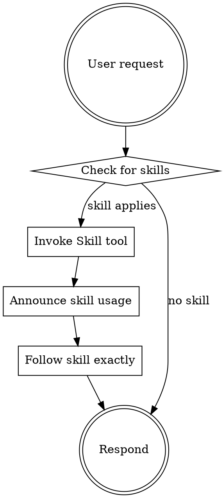

<EXTREMELY-IMPORTANT>
You have access to a comprehensive workflow ecosystem designed to optimize human-agent co-development.

IF A SKILL APPLIES TO YOUR TASK, YOU MUST USE IT. This is not optional.
</EXTREMELY-IMPORTANT>

## Ecosystem Overview

This ecosystem provides three tiers of automation:

| Tier | Component | Purpose | How to Access |
|------|-----------|---------|---------------|
| **1** | Skills | Core competencies and disciplines | `Skill` tool |
| **2** | Commands | User-invokable workflows | `/command-name` |
| **3** | Agents | Specialized subagents for delegation | `Task` tool |

## Available Skills

| Skill | Description |
|-------|-------------|
| `brainstorming` | Facilitates collaborative design through structured dialogue. Use before creative/implementation work. |
| `developing-backlogs` | Creates comprehensive backlogs with bite-sized tasks and TDD commands. Use when planning features. |
| `orchestrating-subagents` | Executes backlogs with fresh subagents and two-stage review. Use for multi-task implementation. |
| `verification` | Enforces evidence-before-claims discipline. Use before claiming completion or success. |
| `git-workflow` | Enforces feature branch workflow with atomic commits. Use for all version control operations. |

## Reference Skills

These skills provide techniques and standards for specific situations:

| Skill | When to Use |
|-------|-------------|
| `systematic-debugging` | When encountering bugs, test failures, or unexpected behavior. 4-phase root cause methodology. |
| `angular-development` | When working with Angular projects. Standalone components, signals, state management detection, performance patterns. |
| `python-development` | When working on Python projects. Standards for uv, ruff, mypy, pytest, type hints. |
| `typescript-development` | When working with TypeScript. Strict mode, type patterns, error handling. |

## Available Commands

| Command | Purpose |
|---------|---------|
| `/brainstorm` | Explore requirements before implementation |
| `/backlog-development` | Create bite-sized backlog |
| `/implement` | Execute backlog with subagent orchestration |
| `/branch` | Create/switch feature branches with enforcement |
| `/verify` | Run pre-completion verification |
| `/workflow` | Manage enforcement state (skip/status/reset) |

## Available Agents

| Agent | Role | When to Dispatch |
|-------|------|------------------|
| `code-implementer` | Execute implementation tasks | Per task in backlog |
| `spec-reviewer` | Verify code matches requirements | After implementation |
| `quality-reviewer` | Assess code quality and style | After spec approval |

## The Core Workflow

```
/branch → /brainstorm (plan mode) → /backlog-development (plan mode) → /implement → /verify → PR
```

### Workflow Details

1. **Branch First**: Create feature branch before any design work
   - Pattern: `feat/<issue>-<slug>` or `fix/<issue>-<slug>`
   - Never commit directly to main/master

2. **Brainstorm in Plan Mode**: Explore requirements (shift+tab twice first)
   - One question at a time
   - **EXIT plan mode before writing** (prevents auto-execution)
   - Writes to `docs/designs/`
   - **STOPS after writing design** - does NOT proceed

3. **Backlog in Plan Mode**: Create bite-sized tasks (shift+tab twice first)
   - Exact file paths, complete code, test commands
   - **EXIT plan mode before writing** (prevents auto-execution)
   - Writes to `docs/backlogs/`
   - **STOPS after writing backlog** - does NOT proceed

4. **Implement with Subagents**: For each task:
   - Dispatch `code-implementer` (follows TDD)
   - Dispatch `spec-reviewer` (validates completeness)
   - Dispatch `quality-reviewer` (assesses quality)
   - Only proceed when all reviewers approve

5. **Verify Before Completion**: Evidence before claims
   - Run test command, see output, THEN claim pass
   - Never say "should work" or "probably fixed"

## Skill Invocation Rules



## Red Flags - STOP and Check Skills

| Thought | Reality |
|---------|---------|
| "Let me just start coding" | Use `brainstorming` skill first |
| "I'll figure it out as I go" | Use `developing-backlogs` skill first |
| "This is a quick fix" | Even quick fixes need TDD |
| "Should work now" | Use `verification` skill first |
| "I'll test later" | TDD means test FIRST |
| "Let me commit to main" | Use `git-workflow` - feature branch required |
| "Let me try this fix" | Use `systematic-debugging` - investigate root cause first |

## Quality Disciplines

These disciplines are NON-NEGOTIABLE:

1. **TDD**: Write test → Watch fail → Implement → Watch pass
2. **Verification**: Run command → See output → THEN claim result
3. **Atomic Commits**: One logical change per commit
4. **Feature Branches**: Never commit to main directly

## Automatic Task Tracking (TODO:BACKLOG)

During `/implement`, the system automatically tracks task completion via code markers:

| Event | What Happens |
|-------|--------------|
| Dispatch code-implementer | `TODO:BACKLOG[task-N]` marker injected into test file |
| Subagent implements | Subagent removes marker as part of completing task |
| Run `/verify` | System sweeps for remaining markers, warns if any found |

**Why this matters:**
- Markers create persistent anchors in code that survive context loss
- Remaining markers indicate potentially incomplete tasks
- The sweep at `/verify` catches tasks that were started but not finished

**For orchestrators:** You'll see hook messages about injection. The code-implementer knows to remove markers - reinforce this in task handoffs if needed.

**For implementers:** Check test files for `TODO:BACKLOG[task-N]` markers during startup. Remove them as you complete the task.

## Workflow Enforcement

The ecosystem enforces workflow discipline through hooks:

### What Gets Blocked vs Warned

| Action | Condition | Enforcement | How to Proceed |
|--------|-----------|-------------|----------------|
| Write/Edit code | On main/master branch | ⚠️ **WARNS** after | Undo, run `/branch` first |
| Write/Edit code | Branch created but no design | ⚠️ **WARNS** after | Undo, run `/brainstorm` first |
| Write/Edit code | Design done but no backlog | ⚠️ **WARNS** after | Undo, run `/backlog-development` first |
| Git commit | Source files without tests staged | 🛑 **BLOCKS** | Stage test files or `/workflow skip` |
| Task completion | Missing reviewer dispatches | ⚠️ **WARNS** after | Dispatch reviewers |

**Note:** Due to a Claude Code runtime limitation ([Issue #4669](https://github.com/anthropics/claude-code/issues/4669)), PreToolUse blocking only works for Bash commands. Write/Edit/TodoWrite actions are warned after-the-fact rather than blocked.

### Workflow Phases

```
idle → branched → brainstorming → backlog-ready → implementing → verifying → idle
       (warns)     (warns)         (allows edits)
```

### Escape Hatch

For experienced users who understand the risks:

```
/workflow skip    # Suppress warnings for this session
/workflow status  # Check current phase
/workflow reset   # Re-enable enforcement
```

**Warning**: Skipping enforcement removes guardrails that prevent bugs and maintain quality.

## Subagent Orchestration Pattern

When using `/implement` or orchestrating subagents:

```
Parent Claude (Orchestrator):
├── Reads backlog once, extracts all tasks
├── Creates TodoWrite with all tasks
├── For each task:
│   ├── Prepare task description
│   ├── Dispatch code-implementer
│   ├── Handle questions if any
│   ├── Dispatch spec-reviewer
│   ├── Fix gaps if any
│   ├── Dispatch quality-reviewer
│   ├── Fix issues if any
│   └── Mark complete
└── Final review after all tasks
```

**Key**: Parent maintains context, subagents receive curated task descriptions.

## Getting Help

- `/help` - Show available commands
- Invoke `Skill` tool with skill name to read skill content
- Check `docs/tutorials/getting-started.md` for walkthrough
