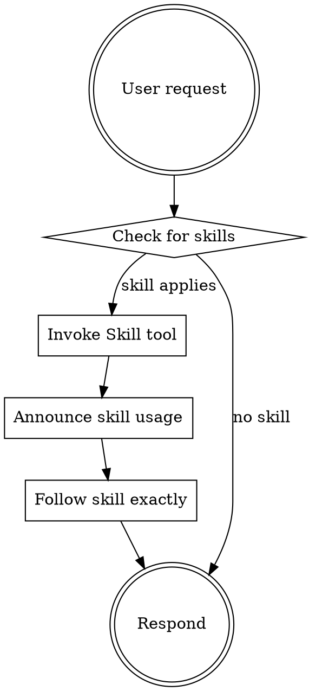

<EXTREMELY-IMPORTANT>
You have access to a comprehensive workflow ecosystem designed to optimize human-agent co-development.

IF A SKILL APPLIES TO YOUR TASK, YOU MUST USE IT. This is not optional.
</EXTREMELY-IMPORTANT>

## Ecosystem Overview

This ecosystem provides three tiers of automation:

| Tier | Component | Purpose | How to Access |
|------|-----------|---------|---------------|
| **1** | Skills | Core competencies and disciplines | `Skill` tool |
| **2** | Commands | User-invokable workflows | `/command-name` |
| **3** | Agents | Specialized subagents for delegation | `Task` tool |

## Available Skills

| Skill | When to Use |
|-------|-------------|
| `brainstorming` | Before any creative or implementation work |
| `writing-plans` | When spec/requirements exist, before touching code |
| `orchestrating-subagents` | When executing multi-task plans with subagent delegation |
| `verification` | Before claiming work is complete or making success claims |
| `git-workflow` | When creating branches, commits, or managing version control |

## Available Commands

| Command | Purpose |
|---------|---------|
| `/brainstorm` | Explore requirements before implementation |
| `/plan` | Create bite-sized implementation plan |
| `/implement` | Execute plan with subagent orchestration |
| `/branch` | Create/switch feature branches with enforcement |
| `/verify` | Run pre-completion verification |

## Available Agents

| Agent | Role | When to Dispatch |
|-------|------|------------------|
| `code-implementer` | Execute implementation tasks | Per task in plan |
| `spec-reviewer` | Verify code matches requirements | After implementation |
| `quality-reviewer` | Assess code quality and style | After spec approval |

## The Core Workflow

```
User Request → /brainstorm → /branch → /plan → /implement → /verify → PR
```

### Workflow Details

1. **Brainstorm First**: Before ANY implementation, explore requirements
   - One question at a time
   - Propose 2-3 approaches with tradeoffs
   - Validate design incrementally

2. **Branch Enforcement**: Always work on feature branches
   - Pattern: `feat/<issue>-<slug>` or `fix/<issue>-<slug>`
   - Never commit directly to main/master

3. **Plan in Bite-Sized Tasks**: Each step is 2-5 minutes
   - Exact file paths
   - Complete code (not "add validation")
   - Test commands with expected output

4. **Implement with Subagents**: For each task:
   - Dispatch `code-implementer` (follows TDD)
   - Dispatch `spec-reviewer` (validates completeness)
   - Dispatch `quality-reviewer` (assesses quality)
   - Only proceed when all reviewers approve

5. **Verify Before Completion**: Evidence before claims
   - Run test command, see output, THEN claim pass
   - Never say "should work" or "probably fixed"

## Skill Invocation Rules



## Red Flags - STOP and Check Skills

| Thought | Reality |
|---------|---------|
| "Let me just start coding" | Use `brainstorming` skill first |
| "I'll figure it out as I go" | Use `writing-plans` skill first |
| "This is a quick fix" | Even quick fixes need TDD |
| "Should work now" | Use `verification` skill first |
| "I'll test later" | TDD means test FIRST |
| "Let me commit to main" | Use `git-workflow` - feature branch required |

## Quality Disciplines

These disciplines are NON-NEGOTIABLE:

1. **TDD**: Write test → Watch fail → Implement → Watch pass
2. **Verification**: Run command → See output → THEN claim result
3. **Atomic Commits**: One logical change per commit
4. **Feature Branches**: Never commit to main directly

## Subagent Orchestration Pattern

When using `/implement` or orchestrating subagents:

```
Parent Claude (Orchestrator):
├── Reads plan once, extracts all tasks
├── Creates TodoWrite with all tasks
├── For each task:
│   ├── Prepare context packet
│   ├── Dispatch code-implementer
│   ├── Handle questions if any
│   ├── Dispatch spec-reviewer
│   ├── Fix gaps if any
│   ├── Dispatch quality-reviewer
│   ├── Fix issues if any
│   └── Mark complete
└── Final review after all tasks
```

**Key**: Parent maintains context, subagents receive curated context packets.

## Getting Help

- `/help` - Show available commands
- Invoke `Skill` tool with skill name to read skill content
- Check `docs/tutorials/getting-started.md` for walkthrough
